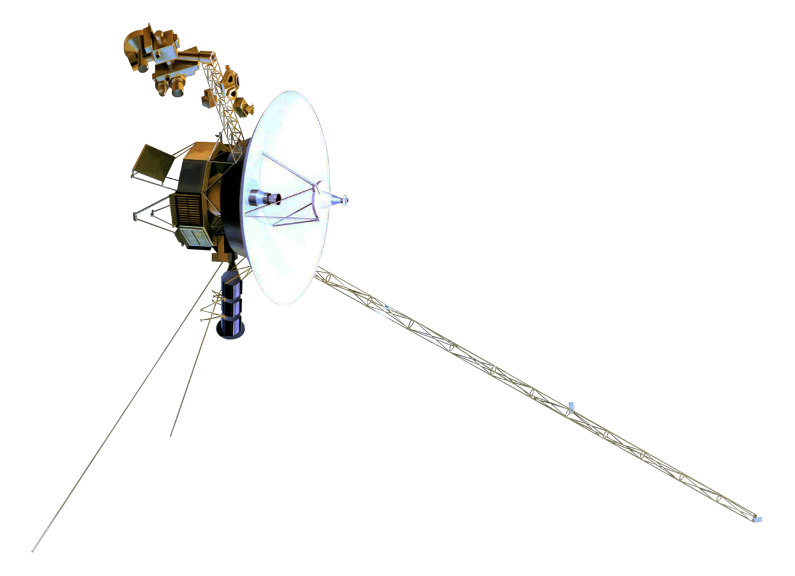

# Telemetrie

Voor we onze robot laten rijden, zorgen we ervoor dat we gegevens kunnen verzamelen over het gedrag van de robot. We zullen deze gegevens nodig hebben om fouten in het gedrag van de robot te debuggen. Omdat onze robot vrij moet kunnen rondrijden, zullen we deze data vanop afstand draadloos verzamelen. Deze techniek noemen we telemetrie ofwel het meten vanop afstand. De belangrijkste gegevens die we willen verzamelen zijn: de metingen van de sensoren, de snelheden van de motoren en het gedrag van de controlevariabelen. Je bent echter niet beperkt om enkel deze gegevens te verzamelen. Als je nog andere data wil meten, kan je de code gemakkelijk aanpassen om dat te doen.

In onze toepassing zullen we via Bluetooth gegevens over de robot versturen naar de computer. Op de computer lezen we deze gegevens en visualiseren ze in verschillende grafieken. Zo krijgen we inzicht in het gedrag van onze robot.

<h2 class="title">Voyager</h2>

Telemetrie is een zeer belangrijke techniek die ingenieurs heel vaak gebruiken. Denk bijvoorbeeld aan toepassingen waarbij het voor een mens onmogelijk is om in de buurt te blijven van het gemonitorde systeem. Bijvoorbeeld een satelliet of een onbemande duikboot. Hier zie je een voorbeeld van de Voyager 1 satelliet. Deze werd in 1977 de ruimte ingestuurd om de planeten en de interstellaire ruimte buiten voorbij deze planeten te verkennen. In januari 2024 bevond Voyager 1 zich op een afstand van 24.2 miljard kilometer van de aarde. Bijgevolg duurt het meer dan 22 uur tussen het versturen van telemetriegegevens vanop de Voyager tot het ontvangen van die gegevens op aarde. 
</img>

