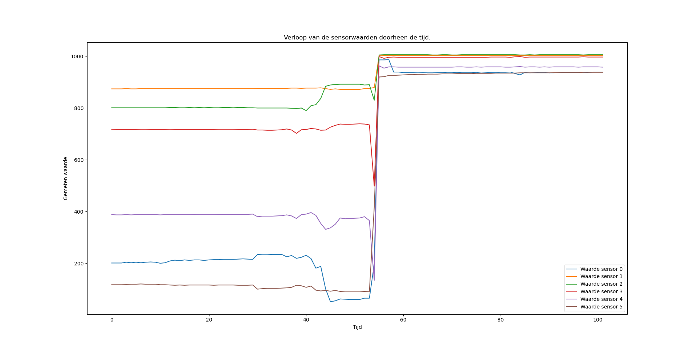

# Data visualiseren

Om meer inzicht te krijgen in de telemetriedata, kan het nuttig zijn om deze data te visualiseren in een grafiek. Dit doen we hier in Python aan de hand van de matplotlib bibliotheek. Je kan deze bibliotheek installeren via het commando:

<pre>
<code class="lang-bash">
pip install matplotlib
</code>
</pre>

Hieronder zie je de code die het mogelijk maakt om een grafiek te maken van de sensorgegevens. Deze code zal zichzelf aanpassen telkens er een nieuwe waarde beschikbaar is. Deze code kan op het eerste zicht overweldigend lijken maar de code is relatief eenvoudig te begrijpen. Lees de commentaar in de code goed om te achterhalen waarvoor elk deel van de code dient.

<pre>
<code class="lang-python">

    # Importeer de pyserial bibliotheek.
    import serial
    # Importeer de matplotlib bibliotheek.
    import matplotlib.pyplot as plt
    import matplotlib.animation as animation

    # Configureer de seriële poort.
    # Deze instelling hangt af van je computer.
    serial_port = 'COM4'  
    # Stel de baud rate in. Deze moet dezelfde zijn als in je Dwenguino programma.
    baud_rate = 9600     

    # Het huidige tijdstip.
    tijdstip = 0
    # Sla het tijdstip op van een meting.
    tijdstippen = [] 
    # Sla de gemeten waarden op.
    sensorWaarden = []

    # Initialize serial connection.
    ser = serial.Serial(serial_port, baud_rate)

    # Deze functie zet een string in csv formaat om naar een lijst met getallen.
    def parse_data_pakket(pakket):
        data = pakket.strip().split(';')
        return [int(getal) for getal in data]

    def update_plot(frame):
        fig.clear()
        # Plot de gemeten waarden.
        for i in range(0, len(sensorWaarden[0])):
            # Selecteer telkens de i-de waarde van elke meting.
            plt.plot(tijdstippen, [meting[i] for meting in sensorWaarden], label='Waarde sensor ' + str(i))
        plt.xlabel('Tijd')
        plt.ylabel('Gemeten waarde')
        plt.legend()
        plt.title('Verloop van de sensorwaarden doorheen de tijd.')
        
        return plt

    # Maak een figuur aan.
    fig = plt.figure()
    animatie = animation.FuncAnimation(fig, update_plot, interval=1000)

    # Blijf lezen van de seriële poort en print de ontvangen gegevens
    while True:
        print('Wachten op gegevens...')
        line = ser.readline().decode('utf-8').strip() # Lees een lijn van de seriële poort.
        print(line)
        
        tijdstippen.append(tijdstip) # Sla het tijdstip op.
        sensorWaarden.append(parse_data_pakket(line)) # Sla de gemeten waarden op.
        tijdstip += 1 # Verhoog het tijdstip met 1.
        
        plt.pause(0.001) # Pauzeer even om de plot te updaten.

</code>
</pre>

    <h2 class="title">Opdracht</h2>
    

        

            Hieronder zie je het verloop van de sensorwaarden van de robot die we bij Dwengo gebouwd hebben. Eerst stonden alle sensoren op een wit oppervlak. Erna werd de robot verschoven naar een zwart oppervlak. Bekijk de waarden goed. Wat merk je op?
        

        

            </img>
        

    

