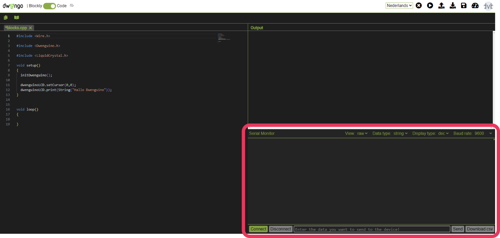

# De seriële monitor van de Dwengo simulator

In de tekstuele editor van de Dwengo simulator kan je rechtsonderaan het venster van de seriële monitor zien. Op onderstaande foto wordt de seriële monitor aangeduid met een roze kader. De seriële monitor maakt gebruik van WebSerial. Niet alle browsers ondersteunen WebSerial. Bijgevolg kan je de seriële monitor **enkel gebruiken wanneer je de Chrome of Edge browser gebruikt!**

</img>
