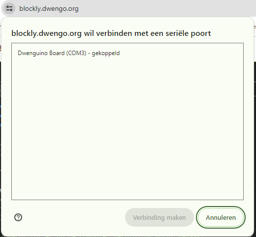
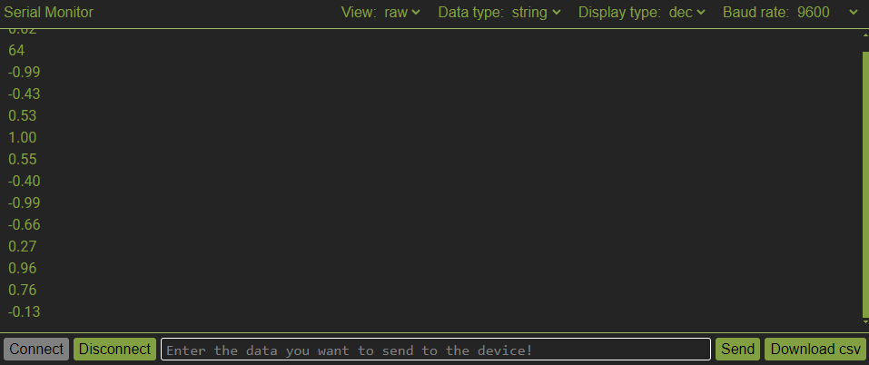

# Gegevens ontvangen

Wanneer je Dwenguino geprogrammeerd is om gegevens te sturen via de seriële verbinding, kunnen we deze gegevens weergeven in de seriële monitor. Volg daarvoor de volgende stappen:

- Zorg ervoor dat de Dwenguino verbonden is met de computer via de usb-kabel.
- Druk onderaan in de seriële monitor op de **Connect**-knop.
- Je ziet het onderstaande venster verschijnen linksboven in de browser.

</img>

- Selecteer de Dwenguino en druk op **Verbinding maken**.
- Als alles goed is, zie je nu getallen verschijnen in de seriële monitor.

