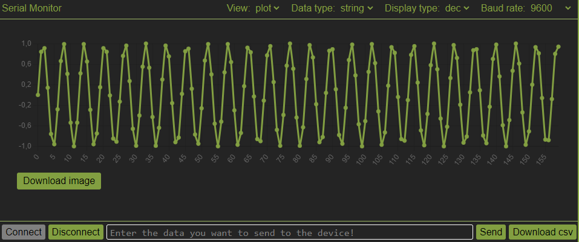

# Gegevens visualiseren

We kunnen de gegevens die we zien in de seriële monitor ook weergeven in een grafiek. Daarvoor open je het dropdownmenu naast *View* en verander je de optie van *raw* naar *plot*. Je zal zien dat je data dan in een grafiek wordt weergegeven. Hieronder zie je een voorbeeld van zo'n grafiek.

</img>

