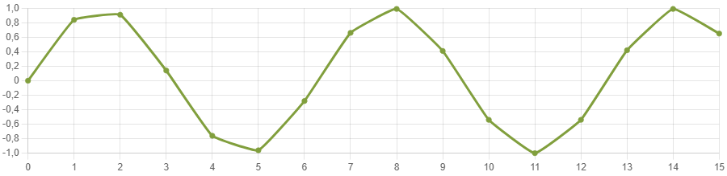

# Gegevens exporteren

Je kan de gegevens die je verzamelde ook exporteren om zo te gebruiken in een ander programma. Dat kan op twee manieren.

### 1. Een afbeelding van de grafiek exporteren

Door in de grafiekweergave van de seriële monitor op de knop **Download image** te klikken, wordt er een afbeelding van je grafiek gedownload. Je kan deze afbeelding dan bijvoorbeeld opnemen in een presentatie. Hieronder zie je een voorbeeld van zo'n grafiek.

</img>

### 2. De gegevens exporteren als .csv bestand

Door rechtsonderaan in de seriële monitor op de knop **Download csv** te klikken, wordt er een .csv bestand met de gegevens in gedownload. Csv staat voor comma separated values. Een .csv bestand is dus een bestand waarin de gegevens gescheiden worden door komma's of op een nieuwe regel staan. Hieronder zie je een voorbeeld van zo'n bestand.

<pre>
<code class="lang-csv">

0.00;-0.16;0.84
0.84;-0.92;-0.01
0.91;-0.83;-0.85
0.14;0.02;-0.91
-0.76;0.85;-0.13
-0.96;0.90;0.76
-0.28;0.12;0.96
0.66;-0.77;0.27
0.99;-0.95;-0.66
0.41;-0.26;-0.99
-0.54;0.67;-0.40
-1.00;0.99;0.55
-0.54;0.40;1.00
0.42;-0.56;0.53
0.99;-1.00;-0.43
0.65;-0.52;-0.99
-0.29;0.44;-0.64
-0.96;0.99;0.30
-0.75;0.64;0.96
0.15;-0.30;0.75
0.91;-0.97;-0.16
0.84;-0.74;-0.92
-0.01;0.17;-0.83
-0.85;0.92;0.02
-0.91;0.83;0.85

</code>
</pre>

Je kan zo'n .csv bestand openen in je favoriete spreadsheetprogramma. Daar kan je de data dan verder verwerken of visualiseren.