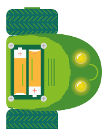

# De Rijdende Robot

Straks gaan jullie een robotje laten rondbewegen. Maar wat heb je nodig om een **rijdende robot** te laten rijden?

Onze rijdende robot heeft twee wielen. Elk wiel heeft een motor die het laat draaien. Als beide motoren even snel draaien, rijdt het robotje recht vooruit. Als één wiel sneller draait dan het andere, draait de robot. Zo kan hij alle kanden op bewegen. Deze manier van rijden noemen we *differentiële aandrijving* (elk wiel kan apart draaien).

> Kun jij voertuigen bedenken die in het echt ook zo worden aangestuurd?

In DwenguinoBlockly ziet de rijdende robot eruit zoals op de afbeelding. Klik rechtsboven op het gelijkaardige icoontje om op de juiste pagina te komen en het robotje in de simulator te zien. 

<h2 class="title">Rijdende robot scenario's</h2>

Er zijn twee scenario's die het icoontje van de rijdende robot gebruiken. Ééntje met en ééntje zonder muren. Kies voor nu het scenario zonder muren, later wordt degene met muren gebruikt.

