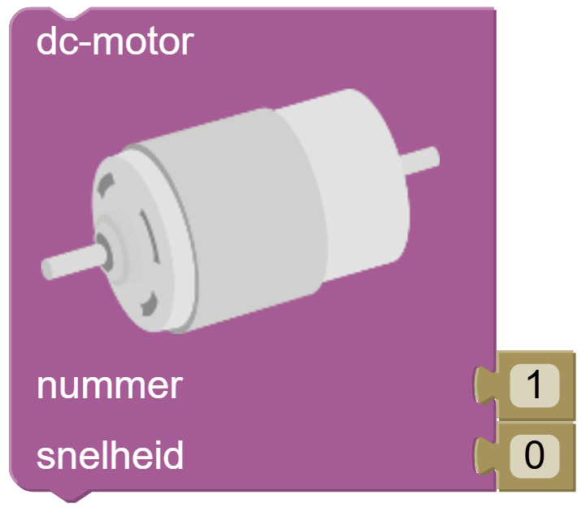

# DC-motor

In DwenguinoBlockly programmeer je met programmeerblokken. Dit zijn de blokjes aan de linkerkant van het scherm die je naar een juiste plek kunt slepen. Hoe een programma eruit ziet met zulke blokjes, leerde je in het leerpad [StartToDwenguino](https://www.dwengo.org/learning-path.html?hruid=pc_starttodwenguino&language=nl&te=true&source_page=%2Fphysical_computing%2F&source_title=%20Physical%20computing#g_inleiding_lkr;nl;3).

Veel van de elektrische onderdelen die besproken worden in dat leerpad, hebben wij niet nodig. Het belangrijkste component bij de Rijdende Robot is de DC-motor. Zijn programmeerblok vind je onder "Dwenguino" en ziet er zo uit:

De DC-motor (of *gelijkstroommotor*) is een klein motortje dat in beide richtingen kan ronddraaien. Onze rijdende robot heeft twee motoren: één per wiel. Door de snelheid te veranderen, laat je de wielen sneller of trager draaien.

- Beide wielen even snel -> robot rijdt recht vooruit.
- Één wiel sneller -> robot draait
