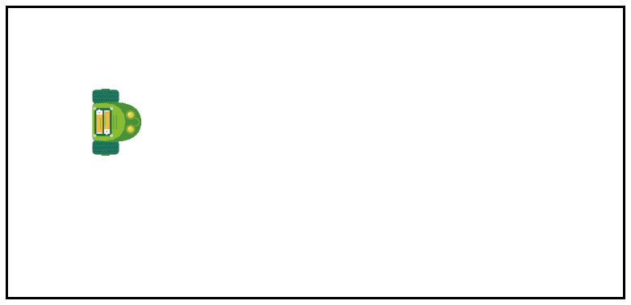

# Scenario met de muur

We gaan over naar het tweede scenario met de rijdende robot. Nu zit het robotje in een ruimte met muren. Hij kan dus niet zomaar blijven rijden, want dan botst hij.

> Laat de robot opnieuw in een vierkant rijden met je zelfgemaakte programma.

De kans is groot dat de robot deze keer tegen een muur rijdt en zijn vierkant niet kan afmaken. We willen ervoor zorgen dat het robotje de muur kan 'zien' en vermijden dat hij er tegen rijdt. We maken hiervoor gebruik van een **afstandssensor**.