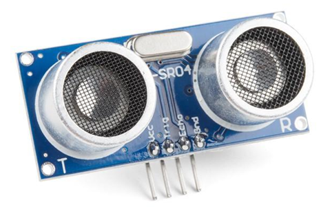

# Afstandssensor: sonar

Een afstandssensor doet wat zijn naam zegt: het meet hoe ver iets voor de robot is. Dit is precies wat we zoeken!

Er zijn verschillende soorten afstandssensors. Wij gebruiken een ultrasone sensor of een **sonar**. Die stuurt ultrasone geluiden uit en meet hoe snel die terugkomen. Zo weet de robot hoe ver een muur (of ander object) is.

> Vleermuizen gebruiken hetzelfde principe om in het donker te 'zien'!

Het programmeerblokje voor de sonar vind je opnieuw onder 'Dwenguino'. We geven een voorbeeldje over hoe je het moet gebruiken. Het gegeven programma leest de waarde van de sonar uit en print deze op het lcd.

<h2 class="title">Stoppen voor de muur</h2>

Maak een nieuw programma waarin de robot vooruit rijdt en vlak voor de muur stopt.

