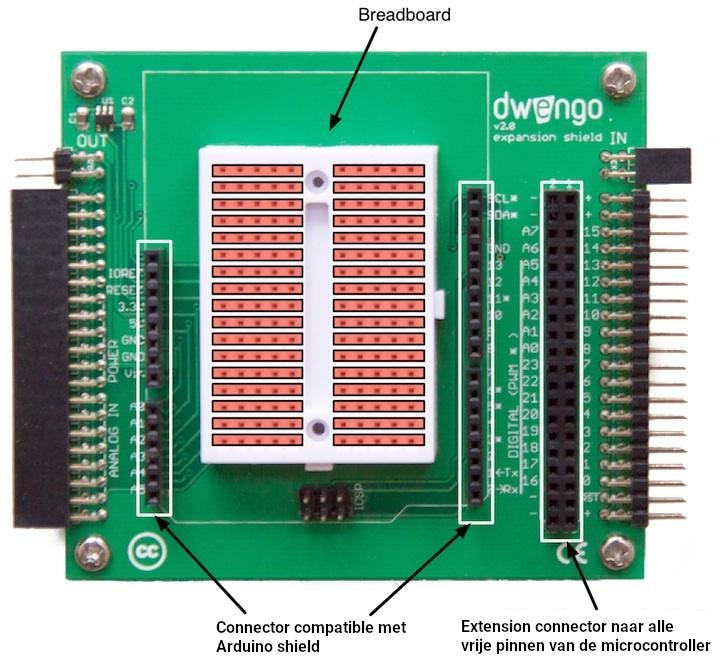

    <h2 class="title">Het breadboard</h2>
    

        

            Wanneer je een elektronisch circuit wil bouwen, doe je dat eerst op een breadboard. Het breadboard is een raster van gaatjes waarop je makkelijk elektronische componenten kan inpluggen. Binnenin het breadboard zijn de rijen met gaatjes met elkaar verbonden. De kolommen worden van elkaar gescheiden door een isolator en zijn dus niet verbonden. Hieronder zie je een afbeelding van het breadboard van de Dwenguino. De oranje balkjes geven aan welke gaatjes er met elkaar verbonden zijn.
        

        

            <figure>
                
                <figcaption>Op de figuur zie je het Dwenguino-uitbreidingsbord. Op dit bord is in het midden een breadboard gemonteerd. De oranje balkjes illustreren hoe de gaatjes van het breadboard vanbinnen met elkaar verbonden zijn.</figcaption>
            </figure>
        

    

