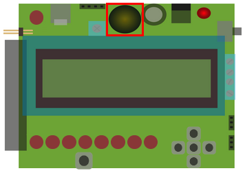

# Theremin

## Componenten

De uitleg over de componenten die je hieronder terugvindt, is een beknopte samenvatting uit <a href="https://staging.dwengo.org/learning-path.html?hruid=pc_starttodwenguino&language=nl&te=true"><strong>het leerpad StartToDwenguino</strong></a>. Indien je dit nog niet hebt doorlopen of nog extra informatie wilt, kan je <a href="https://staging.dwengo.org/learning-path.html?hruid=pc_starttodwenguino&language=nl&te=true"><strong>hier</strong></a> terecht voor een meer uitgebreide uitleg.

De hierop volgende 3 leerobjecten herhalen tevens de basis van de simulator.

Om met de Dwenguino een theremin te maken, zal je gebruik maken van 4 onderdelen:

- lcd-scherm
- zoemer
- knoppen
- sonar-sensor

Hieronder wordt kort beschreven wat de componenten doen en hoe ze eruit zien.

### Lcd-scherm

Het lcd-scherm kan tekst weergeven. Hiermee kan bijvoorbeeld een boodschap worden meegedeeld. 
Op het lcd-scherm van de dwenguino passen maximaal 32 karakters, zoals letters of cijfers, verspreid over twee regels. Je kan dus 16 karakters per regel tonen. 

### Zoemer

Boven het lcd-scherm kan je een een ronde, zwarte component zien. Dit is de zoemer of buzzer. Hiermee kan je geluiden afspelen. 

Geluid is een golf van luchtdruk veroorzaakt door een trillend object zoals bijvoorbeeld een instrument of luidspreker. De hoeveelheid trillingen per seconde (de frequentie) bepaalt de toonhoogte. Wanneer het aantal trillingen per seconde tussen de 20 en 20 000 ligt, dan kan je dit als mens horen. Voor trillingen per seconde gebruiken we de eenheid Hertz, afgekort Hz. De mens kan dus trillingen horen tussen de 20 Hz en 20 000 Hz.

Om geluid te kunnen afspelen is de dwenguino voorzien van een eenvoudige buzzer die je een gekozen frequentie kunt laten afspelen.

### Knoppen

Op de dwenguino vind je vijf drukknoppen. De buitenste knoppen kregen de namen NOORD, ZUID, OOST, WEST, net als in aardrijkskunde. De middelste knop heet MIDDEN.

Je kan op een knop klikken met je muis. Als je erop klikt, is de knop ingedrukt. Als je de knop weer loslaat, is hij niet meer ingedrukt.  

### Sonar-sensor

De sensor stuurt een ultrasoon geluidssignaal uit. Indien er een voorwerp binnen bereik is, zal deze ultrasone geluidsgolf op dit voorwerp weerkaatsen. Je kan de werking vergelijken met de echolocatie van vleermuizen. Door de tijd te meten tussen het verzenden van het geluidssignaal en het ontvangen van de weerkaatste straal, kan de sensor de afstand tot het object nauwkeurig bepalen. 

De afstand wordt teruggegeven in cm. Het bereik van de sonar-sensor is 200 cm.