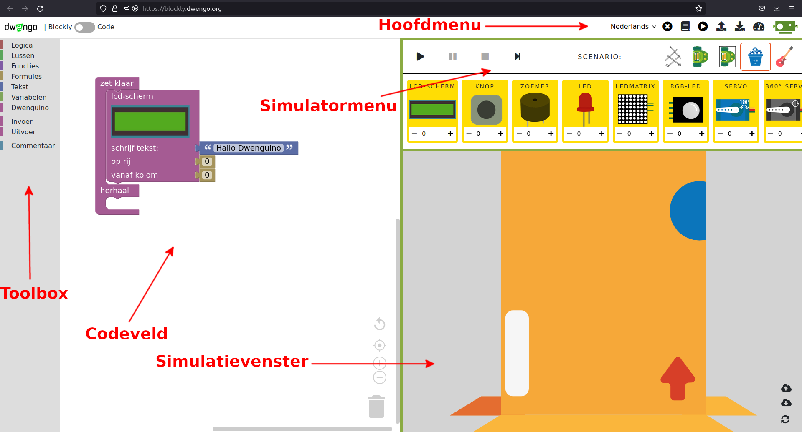

# dwenguinoBlockly  
## Een programmeeromgeving

De programmeeromgeving met simulator is online beschikbaar op [https://blockly.dwengo.org](https://blockly.dwengo.org "link simulator").

Hieronder zie je een screenshot van de omgeving met een beschrijving van de verschillende onderdelen.

1. **Toolbox** In dit menu vind je de verschillende codeblokken terug. Het menu is opgedeeld volgens categorieën die elk een specifieke soort van blokken bevatten. In  kan je bijvoorbeeld alle blokken vinden die iets met invoer (input) te maken hebben.

2. **Codeveld** Hier staat het programma dat je maakt. Het *'zet klaar/herhaal'-blok* staat er al klaar.   

> Enkel code die in het ‘zet klaar’- en 'herhaal'-gedeelte van dit blok geplaatst is, wordt uitgevoerd. Code op een andere plaats wordt niet uitgevoerd. Om te programmeren sleep je dus blokken uit de *toolbox* naar het *codeveld* en klik je deze vast in het *‘zet klaar/herhaal’-blok*. 

3. **Hoofdmenu** Met dit menu kan je acties uitvoeren zoals je code opslaan (met ), terug inladen (met ), of de simulatieomgeving openen en sluiten (met ).

4. **Simulatormenu** Hier vind je de knoppen terug om de simulatie te starten en te stoppen met de knoppen  en .   Het laat je ook toe om een specifiek scenario te kiezen waarbinnen je de code wil uitvoeren. In het voorbeeld is het scenario van de sociale robot geselecteerd. Dit kan je herkennen aan het icoontje van sociale robot .

5. **Simulatievenster** In dit venster zie je een virtuele robot en vaak ook een virtueel microcontrollerbord, de dwenguino, of componenten waarmee je de code kan testen. Omdat op de afbeelding het scenario van de sociale robot geselecteerd is, kan je bovenaan verschillende componenten zien en onderaan een virtuele sociale robot die je kan programmeren. Let wel op: om een programma te simuleren, moet je hier eerst de nodige componenten toevoegen.

In de <em>toolbox</em> kan je dus de blokken terugvinden die je nodig hebt om programma's te maken. Deze blokken moet je hieruit slepen om nadien vast te klikken in de gewenste volgorde in het <em>codeveld</em>.

