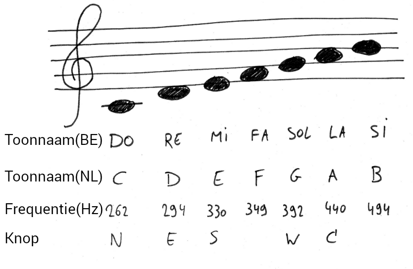

# Theremin

## Pentatoniek

Aan de basis van heel wat muziek ligt een pentatoniek, een tonenreeks van vijf tonen. Men gaat dan met diezelfde 5 tonen een muziekstukje componeren.

> Volgens de Britse componist Howard Goodall is de pentatoniek een universeel gegeven: “Elk muzieksysteem in de hele wereld deelt deze vijf noten. Het lijkt alsof deze noten, net als ons instinct voor taal, in de mens ingebakken zitten.”

Met een beetje programmeerkennis kan je je Dwenguino omtoveren tot een heus pentatonisch instrument: hiervoor koppel je elk van de vijf drukknoppen (N, E, S, W en C) aan een bepaalde toon. 

Geluiden zijn hoorbare trillingen in de lucht. Om muziek te spelen, komt het er dan ook op aan om een instrument te laten trillen met bepaalde goedgekozen frequenties. Zo ook voor de theremin die je maakt met de Dwenguino.

___

Elke toon die de zoemer van de Dwenguino afspeelt, komt overeen met een trilling met een bepaalde frequentie. Zo komen de tonen C, D, E, G en A overeen met trillingen met een frequentie van respectievelijk 262, 294, 330, 392 en 440 Hz.

Om een volwaardig pentatonisch instrument maken van de Dwenguino, moet je dus elk van de vijf drukknoppen (N, E, S, W en C) koppelen aan een bepaalde toon.  
Als voorbeeld kiezen we voor de tonen C, D, E, G en A (met als toonnamen do, re, mi, sol en la). 

Om dit voor elkaar te krijgen, moet je met elk van de vijf drukknoppen op de Dwenguino een frequentie laten overeenkomen, nl. 262, 294, 330, 392 en 440 Hz. Je kan dit eenvoudigweg doen door vijf als-blokken te gebruiken, waarbij je aan elke drukknop de juiste conditie meegeeft (je kan kiezen uit SW_N, SW_E, SW_S, SW_W en SW_C) terwijl je ook de acties aanpast.

Analyseer de voorbeeldcode, programmeer de code op de Dwenguino en test ze uit! 
