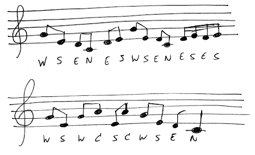

# Theremin

## Pentatoniek

Analyseer de voorbeeldcode, programmeer de code op de Dwenguino en test ze uit! 

Door rechts te klikken op een als-blok kan je deze kopiëren, kies in het menu voor Duplicaat.

Eens de Dwenguino geprogrammmeerd is, kan je het volgende deuntje eens uitproberen. Herken je het?

Probeer het zelf! Er bestaan heel veel pentatonische reeksen. Zoek er een paar op en probeer ook de frequenties van de tonen te weten te komen. Straks, wanneer jouw instrument af is, kan je ze uitproberen.

