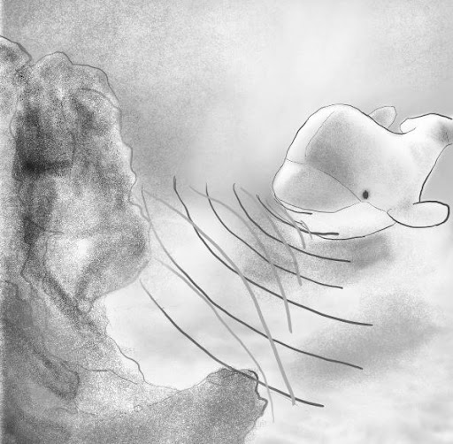

# Theremin

## Sonar-sensor

Een sonar-sensor meet de afstand tot aan een object. Hoe hij dat doet? De sensor stuurt een ultrasoon geluidssignaal uit. Als er een voorwerp binnen bereik is, dan zal deze ultrasone geluidsgolf hierop weerkaatsen. Door de tijd te meten tussen het verzenden van het geluidssignaal en het ontvangen van een ‘antwoord’, kan de sensor de afstand tot het object nauwkeurig bepalen. Met andere woorden, de sonar-sensor detecteert obstakels zoals vleermuizen en walvissen dat doen.

> De afstand x tussen het obstakel en de sonar-sensor kan je bepalen met een eenvoudige formule: x = 340 * (Δt / 2), met x in meter en Δt, de gemeten tijd tussen het uitsturen en het ontvangen van het ultrasoon signaal, in seconden. Hierbij veronderstellen we dat de geluidssnelheid gelijk is aan 340 meter per seconde.

***

Hoe je de sonar-sensor gebruikt, leer je in het volgende leerobject.