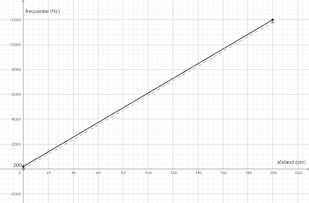

# Theremin

## Van afstand naar geluid

Als je de sonar-sensor wil gebruiken om de frequentie van het geluidssignaal te bepalen, dan moet je deze eerst uitlezen en vervolgens schalen naar een bereik dat voor de mens hoorbaar is. De afstand die de sonar-sensor uitleest (tussen 0 en 200 cm), moet met andere woorden worden omgezet naar een hoorbare frequentie (tussen 200 en 20 000 Hz).

De sonar zal dus een waarde tussen 0 en 200 teruggeven, terwijl geluidssignalen tussen 200 Hz en 12 000 Hz afspeelbaar zijn op de zoemer. Je moet er daarom voor zorgen dat een 0 wordt afgebeeld op 200, en dat 200 wordt afgebeeld op 12 000. Hiervoor programmeer je de volgende formule: frequentie = a * afstand + b. Hierin is a = 11 800 / 200 en b = 200.

Merk op dat we nu gebruik zullen maken van twee variabelen:

<ul>
<li>De variabele afstand waarin de sonar-meting opgeslagen wordt;</li>
<li>De variabele frequentie die de afspeelbare frequentie zal bevatten (na omrekening van de afstand).</li>
</ul>

> De rechte met vergelijking y = 11800 / 200 * x is een rechte door de oorsprong. De grafiek van de rechte met vergelijking y = 11800 / 200 * x + 200 vind je door de grafiek van de eerste rechte met 200 eenheden naar boven te verschuiven. 

