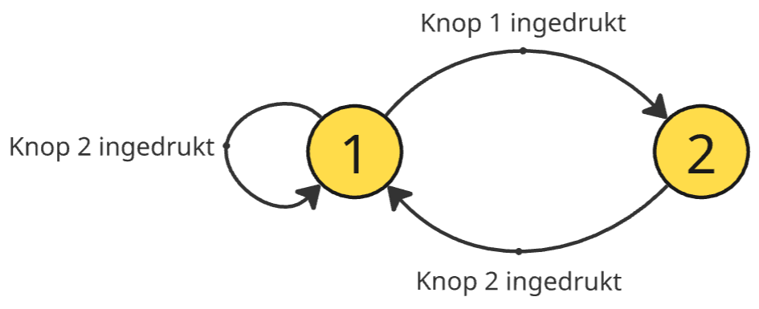
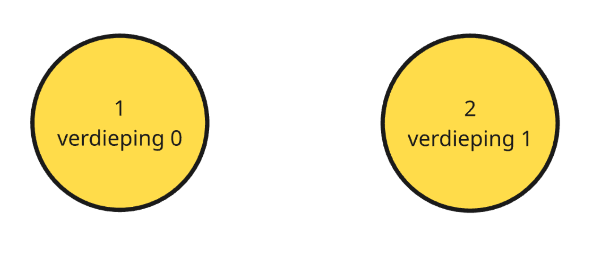
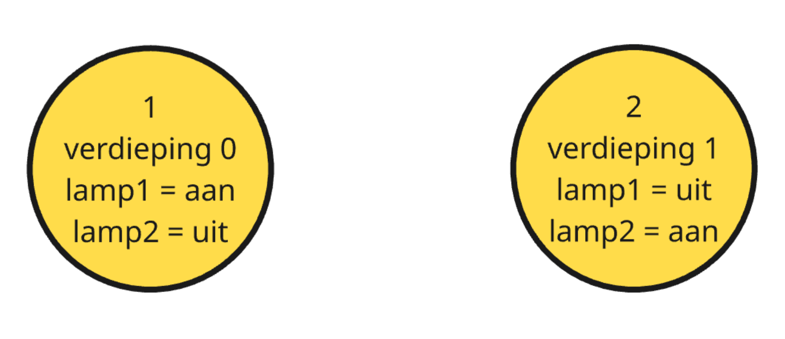
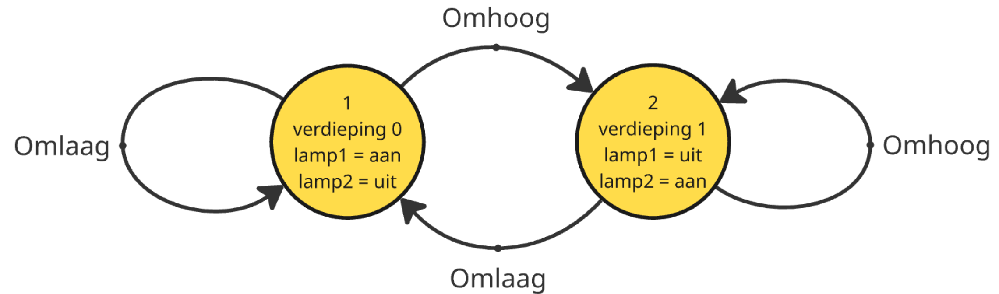

# Toestandsdiagrammen

We kunnen een automaat voorstellen aan de hand van een toestandsdiagram. Voor elke toestand tekenen we een cirkel met daarin de naam en het nummer van de toestand. De overgangen tussen de toestanden geven we aan met behulp van pijlen tussen deze cirkels. Je ziet een voorbeeld op onderstaande afbeelding.

# Opbouw (voorbeeld)

We gaan aan de hand van een voorbeeld uitwerken hoe we een toestandsdiagram voor een bepaald probleem opbouwen. Op deze manier wordt ook duidelijk dat toestandsautomaten krachtige tools zijn om complexe systemen te ontwerpen.

## Beschrijving van de machine
We ontwerpen een controlesysteem voor een lift. De lift kan op één van de twee verdiepingen van een gebouw staan (gelijkvloers of eerste verdieping). In de lift hangen twee knoppen en twee lampjes. De ene knop stuurt de lift naar boven, de andere naar beneden. Wanneer de lift boven is, brandt lamp 2 en wanneer hij beneden is, brandt lamp 1. In beide gevallen is de andere lamp uit. De rest van de elementen van de lift (zoals de deuren en knoppen buiten de lift) negeren we om het voorbeeld eenvoudiger te maken.

### Stap 1: Welke toestanden zijn er?
1) De lift staat op het gelijkvloers.
2) De lift staat op de eerste verdieping.

### Stap 2: Zoek andere belangrijke waarden voor elke toestand.
Zijn er nog elementen in ons systeem die veranderen wanneer de toestand wisselt? In de liften zijn er twee lampen aanwezig. Deze zijn aan of uit afhankelijk van de toestand. Indien we deze waarden toevoegen, krijgen we:

### Stap 3: Transities tussen toestanden identificeren.
Om tussen twee toestanden te wisselen, moet de persoon in de lift op een knop duwen. Hoe deze overgangen verlopen, geven we aan met pijlen zoals in onderstaande afbeelding:

We kunnen het diagram dus op de volgende manieren interpreteren:
- Wanneer de lift op verdieping 0 staat (*toestand 1*) ...
    - ... gaat hij naar verdieping 1 (*toestand 2*) als op de omhoog knop gedrukt wordt.
    - ... blijft hij op verdieping 0 (*toestand 1*) als op de omlaag knop gedrukt wordt.
- Wanneer de lift op verdieping 1 staat (*toestand 2*) ...
    - ... blijft hij op verdieping 1 (*toestand*) als op de omhoog knop gedrukt wordt.
    - ... gaat hij naar verdieping 0 (*toestand 1*) als op de omlaag knop gedrukt wordt.