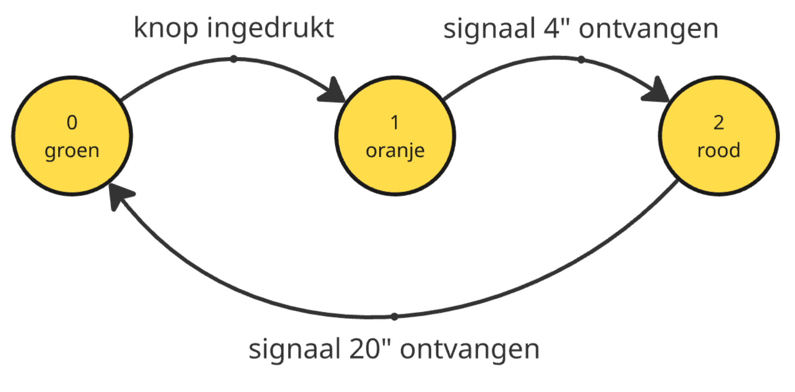
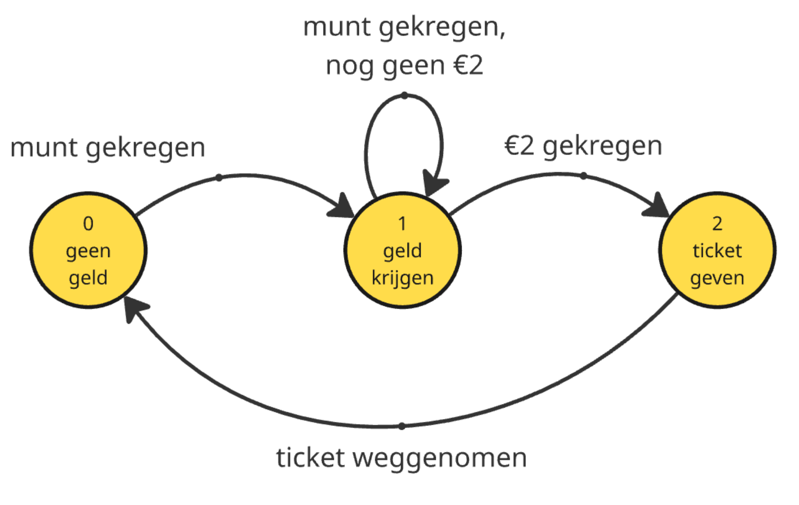
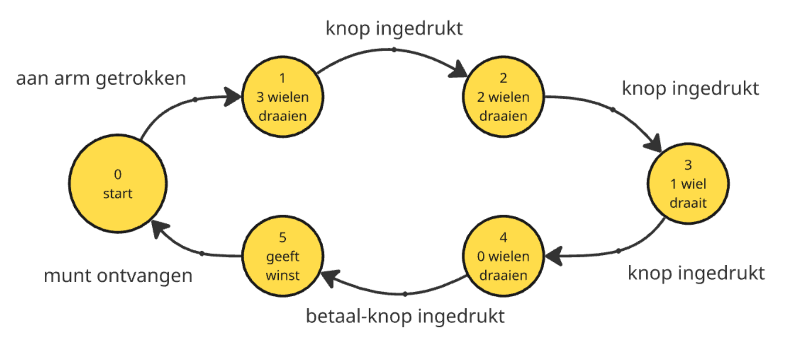

# Oplossingen

Hieronder staan de oplossingen van voorgaande oefeningen op het maken van toestandsdiagrammen. De opgave was steeds: 

*Teken het toestandsdiagram van het opgegeven systeem. Benoem en nummer hierbij de toestanden, alsook de overgangspijlen*

## Opdracht 1: verkeerslicht 🚦

## Opdracht 2: parkeermeter 🅿️

## Opdracht 3: slotmachine 🎰

