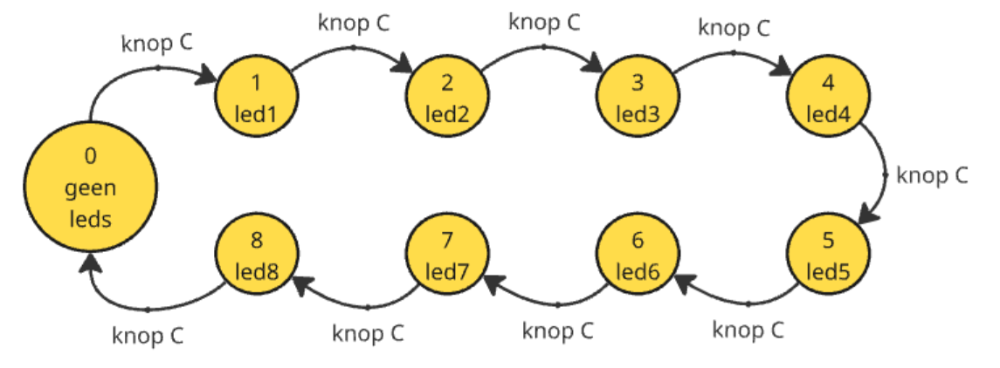

# Toestandsdiagrammen in de praktijk

Nu zien we hoe we de abstracte voorstelling van een automaat kunnen omzetten naar code. Bekijk onderstaand toestandsdiagram.

Het diagram visualiseert het gedrag van het volgende programma:
1. Eerst zijn alle LEDs op de Dwenguino uit.
2. Wanneer we op de "c"-knop drukken, gaat led1 branden.
3. Na twee keer drukken led2, dan led3, ... tot en met led8.
4. Als we dan nogmaals op de knop drukken, begint de cyclus opnieuw.

## Opdracht

### Variabelen

We maken een nieuw Dwenguino-programma dat dit gedrag realiseert. Je kan dit gemakkelijk doen in onze simulator.

Maak om te beginnen een nieuw Dwenguino programma en voeg bovenaan een nieuwe variabele toe van het type *unsigned char*. Geef deze de naam 'toestandsnr' met als startwaarde 0 (nul). Via deze variabele gaat het programma bijhouden in welke toestand hij zit.

<code class="language-cpp">
unsigned char toestandsnr = 0;
</code>

### Toestandsovergangen

Vervolgens moeten we de toestandsovergangen programmeren bij het indrukken van de C-knop. Voeg aan het begin van de loop() functie code toe die kijkt of de knop werd ingedrukt.

*Tip: kijk voor inspiratie naar het codevoorbeeld "Buttons" of gebruik je eerdere kennis.*

Wanneer de C-knop ingedrukt wordt, ga je naar de volgende toestand met behulp van deze code:

<pre>
<code class="language-cpp" data-filename="filename.cpp">
toestandsnr = toestandsnr + 1;
if (toestandsnr == 9){
    toestandsnr = 0;
}
</code></pre>

### LEDS

Als laatste moeten de LEDs nog aangestuurd worden. Welke LED aan moet staan, hangt af van de huidige toestand. Start van de volgende code in de loop() functie (na het bijwerken van de toestand). Vul op de plaats van de '...' de nodige extra code in.

<pre>
<code class="language-cpp" data-filename="filename.cpp">
if (toestandsnr == 0){
    LEDS = 0b00000000;
} else if (toestandsnr == 1){
    LEDS = 0b00000001;
}
...
delay(100);
</code></pre>

 
 
En klaar! Als het goed is, heb je het gedrag van de gegeven automaat gerealiseerd!