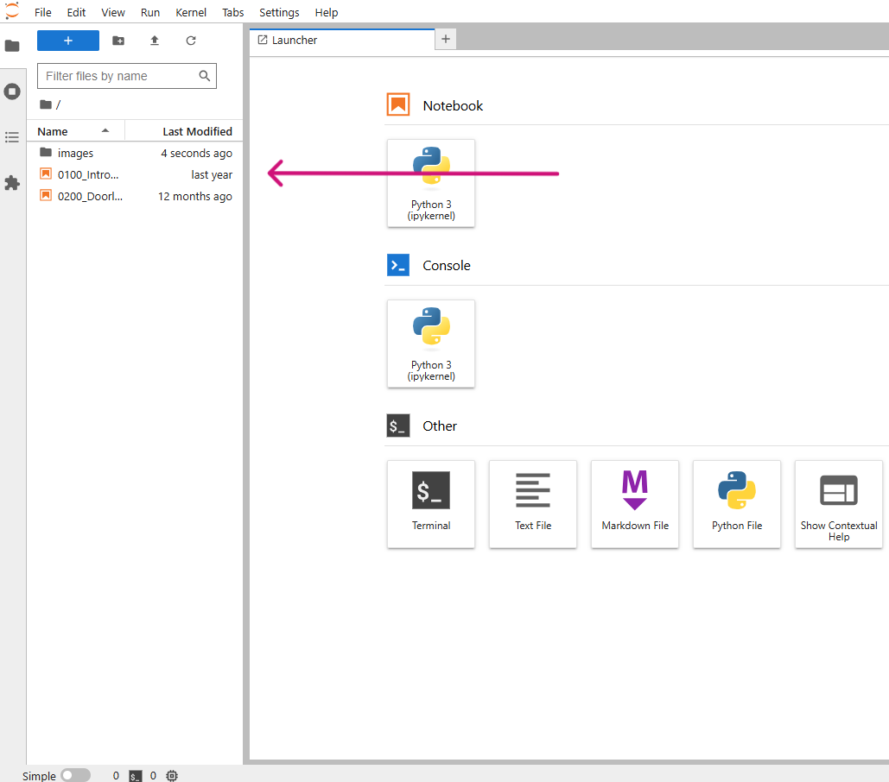

# Werken met notebooks

Het lesmateriaal van 'Python in wiskunde en STEM' wordt aangeboden in de vorm van interactieve **_notebooks_**. Notebooks zijn _digitale documenten_ die zowel uitvoerbare code bevatten als tekst, afbeeldingen, video, hyperlinks ... 

_Nieuwe begrippen_ worden aangebracht via tekstuele uitleg, video en afbeeldingen. 

Er zijn uitgewerkte *voorbeelden* met daarnaast ook kleine en grote *opdrachten*. In deze opdrachten zal je aangereikte code kunnen uitvoeren, maar ook zelf code opstellen. 

De code die in de notebooks gebruikt wordt, is Python versie 3. We kozen voor Python omdat dit een heel toegankelijke programmeertaal is, die vaak ook intuïtief is.  
Python is bovendien bezig aan een opmars en wordt gebruikt door bedrijven zoals Google, NASA, Netflix, Uber, AstraZeneca, Barco, Instagram en YouTube.

We kozen voor notebooks omdat daar enkele belangrijke voordelen aan verbonden zijn: leerkrachten moeten geen geavanceerde installaties doen om de notebooks te gebruiken, leerkrachten kunnen verschillende soorten van lesinhouden aanbieden via één platform, de notebooks zijn interactief, leerlingen bouwen de oplossing van een probleem stap voor stap op in de notebook waardoor dat proces zichtbaar is voor de leerkracht ([Jeroen Van der Hooft, 2023](https://libstore.ugent.be/fulltxt/RUG01/003/151/437/RUG01-003151437_2023_0001_AC.pdf)).    

---
Klik je op onderstaande knop 'Open notebooks',  dan word je doorgestuurd naar een andere website waar jouw persoonlijke notebooks ingeladen worden. (Dit kan even duren.)

Eenmaal alles ingeladen is, kom je terecht in Jupyter Lab en vind je links op het scherm twee (oranje) bestanden met extensie _.ipynb_.
Dit zijn de twee notebooks waarin je respectievelijk een overzicht krijgt van de opbouw en mogelijkheden en hoe je er mee aan de slag kan.
Ook zie je er een map *images* staan. Deze map bevat de afbeeldingen die in de notebooks getoond worden.

Om een bestand of map te openen, dubbelklik je op de bestands-/mapnaam.

In deze eerste twee notebooks leer je hoe de notebooks zijn opgevat en hoe je ermee aan de slag kan. 
Na het doorlopen van beide notebooks heb je een goed idee van hoe onze Python notebooks zijn opgebouwd.

