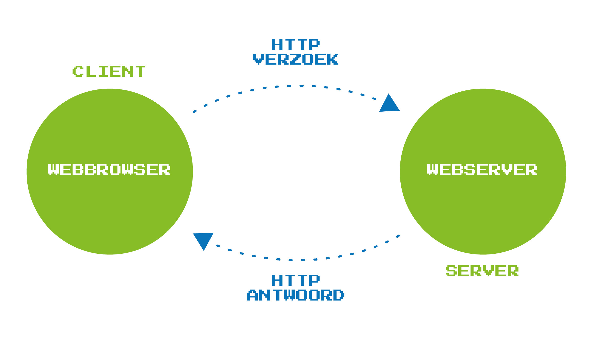

# IP-adres
Het internet geeft toegang tot het world wide web, waarop men allerhande informatie kan vinden via websites. 
Elke website heeft een unieke locatie op het internet, weergegeven door zijn **internetprotocol-adres**, kortom IP-adres. 
> Een protocol is een set regels die vastleggen hoe twee digitale apparaten met elkaar kunnen communiceren.

IP-adressen bestaan uit een rij cijfers (meestal vier getallen). De website van AI Op School bv. heeft 157.193.244.98 als IP-adres. 
Zo'n IP-adres is niet zo gemakkelijk te onthouden, daarom gebruiken we domeinnamen zoals [www.aiopschool.be](http://www.aiopschool.be). 

De omzetting van de domeinnaam naar het IP-adres gebeurt via het **internetprotocol Domain Name System (DNS)**. 
Als een domeinnaam wordt ingegeven in de webbrowser, dan zal de browser de DNS-server contacteren. Op deze server staat een database van de domeinnamen met hun overeenkomstig IP-adres. De browser zal de DNS-server vragen naar het IP-adres
van de gewenste website, waarna hij de opgevraagde website zal tonen.

Sommige IP-adressen zijn opgebouwd met tiendelige getallen, andere met hexadecimale getallen. 
In deze notebook wordt dan ook ruim aandacht besteed aan binaire, tiendelige en hexadecimale getallen. Je leert ook hoe je met Python vlot van het ene naar het andere talstelsel omzet. 
Met deze notebook kan je illustreren waarom binaire en hexadecimale talstelsels belangrijk zijn in de computerwetenschappen.

----
#### Link met de minimumdoelen
Dit thema gaat over computationeel denken. Een IP-adres biedt immers een antwoord op de vraag hoe jouw computer een gewenste website kan vinden. Via dit internetprotocol slaagt de browser op jouw computer erin de website met die bepaalde domeinnaam op jouw computerscherm te laten verschijnen.

Je kan dit als thema gebruiken om in de klas te werken aan het minimumdoel over de impact van digitale systemen. Omdat digitale systemen met elkaar kunnen communiceren, kunnen we bijvoorbeeld beschikken over het Internet of Things (IoT). 

