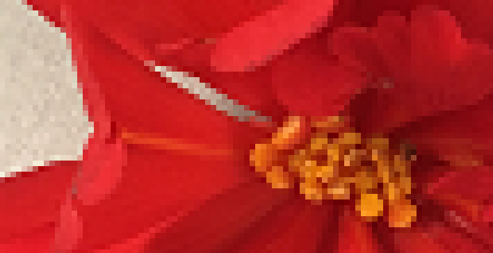

# Inleiding
Een digitaal beeld bestaat uit een eindig aantal pixels. Als je genoeg vierkantjes in een raster plaatst, kan je een grote figuur voorstellen. 
Het woord 'pixel' is afgeleid van de Engelse woorden *picture* (afbeelding) en *element*. 
Het woord digitaal komt van het Latijnse *digitus* (vinger) en verwijst naar het tellen op de vingers. 

Op een goede foto kan je geen pixels onderscheiden, tenzij je sterk inzoomt op de afbeelding.  

In dit leerpad leer je hoe je de kleuren van een afbeelding kunt aanpassen en manipuleren.
