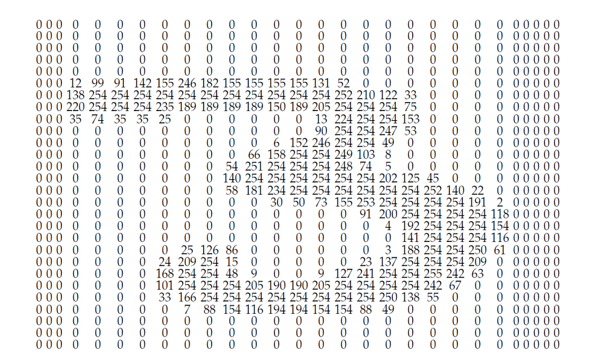

# Afbeeldingen in grijswaarden

Een afbeelding in grijswaarden is voor een computer niets anders dan een raster van getallen. 

<figure>
    <figcaption align = "center">Een drie uit de MNIST-dataset. De MNIST-dataset bestaat uit 70.000 afbeeldingen van handgeschreven cijfers, elk 28 x 28 pixels in grijswaarden.</figcaption>
</figure>

<figure>
    <figcaption align = "center">De pixelwaarden van deze drie.</figcaption>
</figure>

-----------------
Om hiermee vertrouwd te worden, kan je twee notebooks doorlopen.

De eerste notebook onthult hoe digitale beelden in grijswaarden zijn opgebouwd en hoe de computer ernaar kijkt. 
De tweede notebook toont hoe je door bewerkingen uit te voeren op het raster, een afbeelding kan manipuleren. 

--------------
#### Opdracht
In het kader van het mediawijs minimumdoel uit de tweede graad '**De impact van digitale systemen**'

Enkele denkpistes: 
- Begrijp je hoe men foto's kan manipuleren?
- Kan je de link leggen naar fake news?
- Hoe kan je foto's beter maken? Bv. hoe kan je ze donkerder of lichter maken?
- Wat zou dit kunnen betekenen voor de job van fotograaf of designer?
- Wat je in de notebook leerde, kadert in de digitale representatie van informatie. Leg dit uit. 

-----------
#### Link met minimumdoelen wiskunde
In de wiskunde noemt men zo'n raster een **matrix**. 
