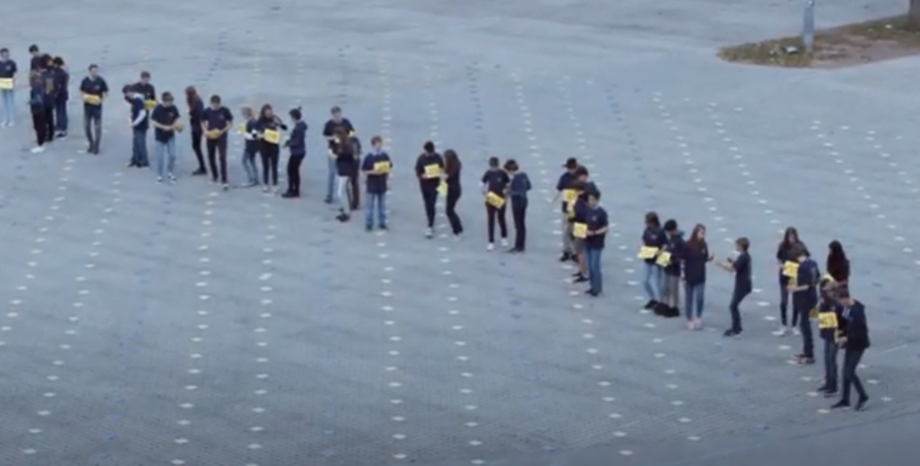

# Algoritmen: toepassingen

Algoritme van Dijkstra en A*-algoritme in de module ['Werking routeplanner'](https://dwengo.org/backend/api/learningObject/getWrapped?hruid=aiz_routeplanner&version=3&language=nl).  
Deze module krijgt [hier](https://dwengo.org/backend/api/learningObject/getWrapped?hruid=ct9_2&version=3&language=nl) meer duiding.

Verdeel-en-heers en gulzig algoritme komen aan bod in het project ['AI in de Zorg'](https://dwengo.org/zorg). Kijk bv. eens naar hoofdstuk 6 van de [leerlingencursus](https://www.dwengo.org/assets/files/care/AIindeZorg_doorstroom_eerstedruk.pdf) voor de finaliteit doorstroom. De leerlingen ontewerpen er een algoritme om een binaire beslissingsboom op te stellen. 

In het project ['KIKS'](https://dwengo.org/kiks/) en het project ['AI in de Landbouw'](https://www.dwengo.org/landbouw) wordt een algoritme voor objectherkenning gebruikt.

Bij de [sentimentanalyse](https://dwengo.org/learning-path.html?hruid=cb2_sentimentanalyse&language=nl&te=true&source_page=%2Fchatbot%2F&source_title=%20Chatbot#pn_sa_inleiding;nl;3) in het project [Chatbot](https://dwengo.org/chatbot/) wordt gezocht in een lexicon, net zoals bij andere toepassingen van NLP die daar worden geïllustreerd. Dus daar wordt een zoekalgoritme gebruikt.  
Zoekalgoritmes komen ook aan bod in de unplugged activiteit ['Zoektocht naar spraak'](https://www.dwengo.org/backend/api/learningObject/getWrapped?hruid=aiz_lockedin&version=3&language=nl)

In de module [Jommeke inkleuren](https://dwengo.org/learning-path.html?hruid=art_jommeke&language=nl&te=true&source_page=%2Fart%2F&source_title=%20Kunst#org-dwengo-jommeke-definitie-ai-systeem;nl;1) wordt een algoritme voor het automatisch inkleuren van Jommeke strips gebruikt. 

Sorteeralgoritme: 
  
 + [korter filmpje](http://www.csunplugged.nl/08-sorteernetwerken/) + [uitleg van het algoritme](http://www.csunplugged.nl/wp-content/uploads/activiteit-8.pdf)

