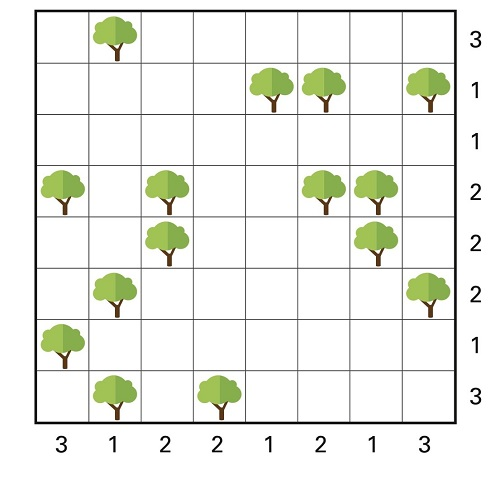
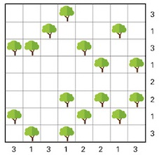
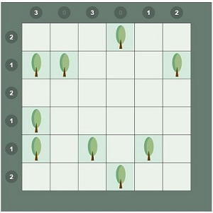

# Puzzel Tentje-boompje

### Probleemstelling
- Bekijk het gegeven veld met bomen.
- Onder, naast of boven elke boom komt er een tent te staan. Meerdere tenten per boom zijn toegestaan. 
De velden van de tenten mogen elkaar niet raken, ook niet diagonaal.
- Bij elke rij en kolom staat gegeven hoeveel tenten er in die rij of kolom moeten staan. 

<figure>
    <figcaption align = "center">Afbeelding gebruikt op basis van citaatrecht. Bron: Het Nieuwsblad - NU, 21 oktober 2023.</figcaption>
</figure>

### Opdracht
- Schrijf in de notebook een programma dat deze puzzel voor jou oplost.
- Omschrijf hoe je hierbij **principes van computationeel denken** hebt aangewend. Je kan daarvoor eventueel het onderstaande schema gebruiken. Je werkwijze moet duidelijk zichtbaar zijn in de notebook.
- Test het programma uit.
- Wat is de oplossing van de puzzel?

  

------------------
Je kan je programma nu gebruiken om soortgelijke puzzels, bijvoorbeeld de onderstaande, op te lossen.

<figure>
    <figcaption align = "center">Afbeelding gebruikt op basis van citaatrecht. Bron: Het Nieuwsblad - NU, 14 oktober 2023.</figcaption>
</figure>

<figure>
    <figcaption align = "center">Afbeelding gebruikt op basis van citaatrecht. </figcaption>
</figure>

Bron: [Het Nieuwsblad Tentje-Boompje mini](https://www.nieuwsblad.be/tentjeboompjemini)

<figure>
    <figcaption align = "center">Afbeelding gebruikt op basis van citaatrecht. </figcaption>
</figure>

Bron: [puzzle-loop.com](https://nl.puzzle-tents.com/?size=4)
