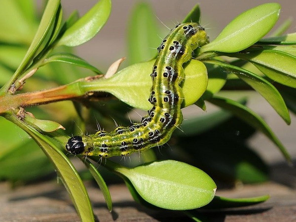

# Modelleren van een rupsenuitbraak

## Ecologen modelleren

**Ecologen bestuderen hoe levende organismen interageren met andere levende organismen en met hun omgeving.** 

Een van de meest fundamentele vragen die ze proberen te beantwoorden, is hoe een populatie van dieren, planten, bacteriën of mensen verandert doorheen de tijd. Groeit ze? Daalt ze? Stagneert ze? Gaat de populatie op en neer? Kan ze plots imploderen? 

Dit soort vragen beantwoorden ecologen aan de hand van **groeimodellen**: wiskundige vergelijkingen die de (verwachte) groei doorheen de tijd voorstellen. 

## Ontmoet de buxusmot

Vele insecten zijn nuttig, maar vaak zijn ze een plaag wanneer ze de planten opvreten. Zo is de rups van de buxusmot (*Cydalima perspectalis*) een nachtmerrie voor elke tuinier met een mooie buxushaag. De buxusmot is een invasieve soort in Europa met een grote economische kost. Meer informatie lees je op de [website van ILVO](https://ilvo.vlaanderen.be/nl/dossiers/buxusmot).

Omdat deze rups zo schadelijk is, zijn ecologen en gewasbeschermers erg geïnteresseerd om de groei van populaties op te volgen en te modelleren. **Wiskundige modellen helpen hen om in te schatten of de populatie binnen een aanvaardbare grootte blijft of wanneer ze dreigt uit haar voegen te treden en bestrijding nodig is.**

## Een wiskundig model

Het doel is om een rij te bekomen die de populatiegrootte doorheen de tijd voorstelt: 
<align="center"><em><b>u0, u1, u2, ..., ut-1, ut, ...</b></em>

Hierbij geldt: 
-  <em>u0</em> is de initiële populatiegrootte: het aantal rupsen bij het begin van de metingen.
-  <em>ut</em> stelt de populatiegrootte voor op generatie of tijdstip <em>t</em>.
-  <em>t</em> neemt de waarden <em>0, 1, 2, 3, ...</em> aan.

<strong>Stel dat <em>ut-1</em>, het aantal rupsen op het tijdstip <em>t-1</em>, gekend is.  Wat is dan <em>ut</em>? M.a.w. hoeveel rupsen zijn er dan op tijdstip <em>t</em>?</strong>

Je gaat dus op zoek naar een vergelijking die vertelt wat de populatiegrootte op tijdstip *t* is, gegeven het aantal rupsen op tijdstip *t-1*. 

**Een wiskundig model is altijd een vereenvoudiging van de werkelijkheid.** Hier zal je een rupsenpopulatie modelleren in niet-overlappende generaties.

Om te beginnen ga je uit van drie **veronderstellingen** voor zo'n vergelijking:

- De vergelijking is *deterministisch*: eenzelfde aantal op tijdstip *t-1* resulteert altijd in eenzelfde aantal op tijdstip *t*. Er wordt dus geen rekening gehouden met willekeurige fluctuaties.

- De populatiegrootte kan voorgesteld worden aan de hand van reële getallen in plaats van natuurlijke getallen. In werkelijkheid zijn er geen (levende) 'halve' rupsen; voor wie zich niet helemaal lekker voelt bij fracties van rupsen, je kan ook over *ut* denken als de biomassa van rupsen, de totale massa van de rupsen op tijdstip *t*. Bij aanzienlijke populatiegroottes bijvoorbeeld kan met een eenheid van 100 of 1000 gewerkt worden, waardoor de aantallen door kommagetallen kunnen weergegeven worden.

- De *tijd* tikt *discreet* door: de populatiegrootte wordt bekeken in een rij van perfect gescheiden generaties. Een model geeft de populatiegroottes aan op tijdstippen *0, 1, 2, 3, ...*. Het houdt bijvoorbeeld geen steek om te kijken naar tijdstip *2,4*. Er is niets tussen de generaties!

Een discreet model kan je dus zien als een soort van uurwerk dat verder tikt. Elke stap wordt dezelfde regel toegepast op een variabele, om van de huidige generatie naar de volgende te gaan.

Afhankelijk van de manier waarop je de regel concretiseert, bekom je een ander model. In de latere onderdelen van dit leerpad zal je elk van de bovenstaande veronderstellingen versoepelen om zo realistischere modellen te bekomen.

Je start met twee discrete modellen:

- Exponentiële groei, waar de populatie ofwel uitsterft ofwel blijft groeien zonder rem.
- Logistische groei, waar de populatie wel een limiet heeft en een veel rijker gedrag kan vertonen.

Een wiskundig model is altijd een vereenvoudiging van de werkelijkheid.

Een wiskundig model helpt om de werkelijke situatie beter te begrijpen.

