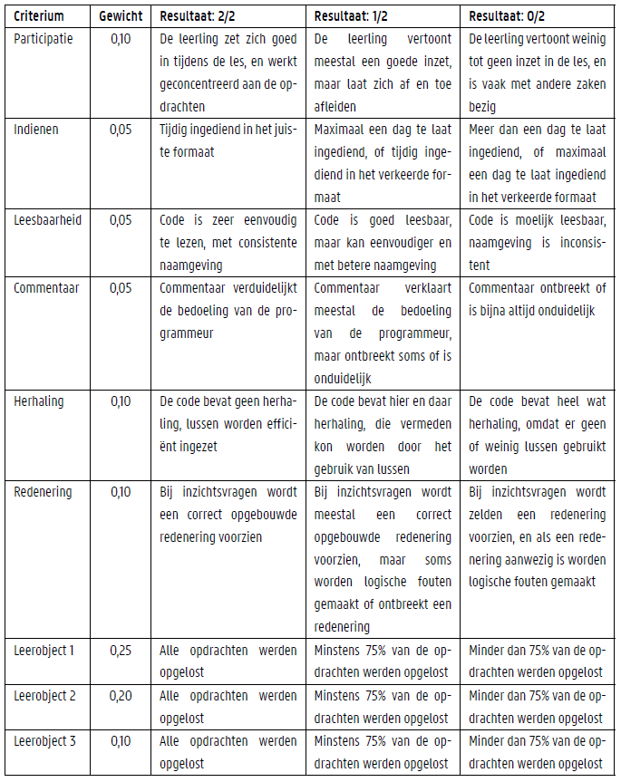

# Modelleren van een rupsenuitbraak

Dit lesmateriaal wordt beschikbaar gesteld voor leerkrachten die aan de slag wensen te gaan met de vernieuwde minimumdoelen wiskunde en informaticawetenschappen in de derde graad doorstroomfinaliteit. Hierbij worden zes leerobjecten voorzien:

- Exponentiële groei
- Logistische groei
- De chaos verklaard
- De Lesliematrix
- De eindige differentiemethode
- Differentiaalvergelijkingen

Het staat de leerkracht vrij om te kiezen welke leerobjecten al dan niet aan bod komen. Om de leerkracht te helpen bij deze keuze, wordt bij elk leerobject extra informatie voorzien: een samenvatting van de belangrijkste wiskundige concepten die aan bod komen, een overzicht van programmeerspecifieke elementen die gebruikt worden, en de minimumdoelen die geadresseerd worden.

## Richtingen

Deze module kan ingezet worden in de volgende vakken uit de derde graad doorstroomfinaliteit:

- Economie-Wiskunde
- Grieks-Wiskunde
- Latijn-Wiskunde
- Technologische wetenschappen en Engineering
- Wetenschappen-Wiskunde
- Biotechnologische en chemische STEM-wetenschappen
- Informatica- en communicatiewetenschappen
- Mechatronica
- Bedrijfsondersteunende informaticawetenschappen
- Bedrijfswetenschappen (GO!)

## Werkwijze

De interactieve notebook voorziet in heel wat opdrachten voor de leerlingen, waarbij zij verschillende minimumdoelen nastreven. Belangrijk hierbij is ervoor te zorgen dat er voldoende laptops of computers beschikbaar zijn: bij voorkeur één toestel per leerling. De voorkeur gaat naar een lokaal dat groot genoeg is, zodat leerlingen de vrijheid hebben om te werken en de leerkracht voldoende ruimte heeft om zich te verplaatsen en vragen van leerlingen te beantwoorden.

Op basis van recent onderzoek wordt aangeraden om leerlingen in paren van twee te laten werken aan de verschillende opdrachten, waarbij er een gezonde mix is van leerlingen met en zonder eerdere programmeerervaring. De leerkracht is er bij voorkeur waakzaam voor dat leerlingen die voornamelijk alleen wensen te werken hiertoe de kans krijgen, door hen te paren met leerlingen die een gelijkaardige voorkeur toegedaan zijn. Zij kunnen nog steeds overleggen, maar krijgen zo ook de kans om individueel aan de slag te gaan. Merk op dat dit laatste ook kan bij leerlingen die meer samenwerken: beide leerlingen kunnen individueel typen op een eigen laptop of computer, zodat ze beiden werken aan de vaardigheid van het programmeren. De uiteindelijke keuze voor een of twee apparaten per paar leerlingen ligt bij de leerkracht, die hierbij rekening kan houden met het beschikbare materiaal.

## Evaluatie

 Om te evalueren of de leerlingen de minimumdoelen bereikt hebben, zijn er een aantal opties:

- De leerkracht beperkt zich tot deze notebook, en vraagt de leerlingen om de notebooks te exporteren naar een PDF-bestand. Dit bestand kan dan online ingediend worden (e.g. via Smartschool) en geëvalueerd worden door de leerkracht.

- De leerkracht voorziet in een tweede notebook met extra oefeningen, waarbij een nieuw probleem gebaseerd op de exponentiële groei vermeld wordt. Reeds bestaande opdrachten kunnen hergebruikt worden, specifiek toegepast op het nieuwe probleem. Leerlingen kunnen hierbij eventueel gebruikmaken van de code die ze eerder implementeerden; een programmeur zal immers hetzelfde doen.

De leerkracht kan bij de evaluatie gebruikmaken van een rubric, die op voorhand gedeeld wordt met de leerlingen. Zo is het voor hen meteen duidelijk welke zaken belangrijk zijn voor hun leerproces. Ook voor de leerkracht is dit een handig hulpmiddel, dat kan helpen om het evaluatieproces efficiënt en transparant te doen verlopen. Een voorbeeld van een rubric, die de eerste drie leerobjecten omvat, kan hieronder teruggevonden worden.

## Contact

Indien er vragen of opmerkingen zijn over het voorziene lesmateriaal, vragen we om Dwengo te contacteren via e-mail.
