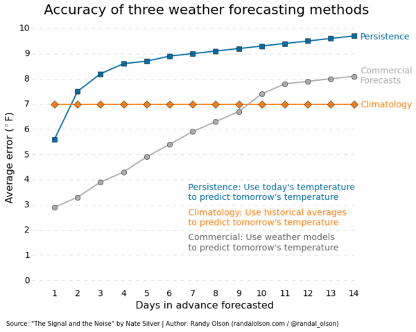

# De chaos verklaard

Eerder bekeken we het logistische groeimodel om een populatie rupsen voor te stellen. Hierbij stelden we vast dat het model voor bepaalde startwaarden \((u_0\)) totaal onvoorspelbaar is! In deze module zal je leren hoe dit komt.

## Interactieve notebook

In deze module ga je meteen aan de slag met een interactieve online notebook, waarin je Python zal gebruiken om enkele interessante grafieken op te stellen.

## De insecten voorbij

De logistische vergelijking is enorm belangrijk, niet omdat ze biologisch gezien zo realistisch is, maar omdat het een van de simpelste manieren is om een chaotische reeks te genereren. **Chaostheorie, de wetenschap dat kleine oorzaken grote, onverwachte gevolgen kunnen hebben**, is een relatief jonge tak van de wiskunde. Ze kon pas bloeien in de 20ste eeuw, toen computers het mogelijk maakten om snel computationele experimenten uit te voeren (zoals jij hier gedaan hebt).

Een van de pioniers in dit veld was de weerkundige **Edward Lorenz**. Terwijl hij experimenteerde met een eenvoudig weermodel rondde hij de getallen af van zes naar drie cijfers om de berekeningen sneller te laten lopen. Tot ontsteltenis van de wetenschappelijke gemeenschap, die er tot dan van uitging dat deze afronding slechts in een triviale afrondingsfout zou resulteren, werd vastgesteld dat deze tot **significant verschillende uitkomsten** leidde. Tegenwoordig is het algemeen aanvaard dat systemen zoals het weer (en de stromingen van vloeistoffen in het algemeen) chaotisch zijn. Dit maakt het zo goed als onmogelijk om het weer meer dan een week op voorhand nauwkeurig te voorspellen. Onderstaande grafiek toont dit aan:

Hier zie je de gemiddelde fout tussen de voorspelde en de geobserveerde temperatuur als een functie van het aantal dagen in de toekomst waarvoor je de temperatuur tracht te voorspellen. Als je je enkel baseert op klimatologische data - bijvoorbeeld door na te gaan hoe warm het typisch is op deze dag van het jaar - dan zien je dat de fout 7 graden Fahrenheit bedraagt, of ongeveer 4 graden Celsius (oranje). Voorspel je dat de temperatuur de komende dagen niet zal veranderen (blauw), dan verkrijg je enkel daags nadien een voorspelling die nauwkeuriger is dan deze op basis van klimatologische data. Gebruik je finaal geavanceerde weersmodellen (grijs), dan zie je dat **de afwijking tussen de voorspelde en de werkelijke temperatuur toeneemt naarmate je verder in de tijd proberen te voorspellen**. Dit toont aan dat het inderdaad moeilijk is om het weer ver op voorhand te voorspellen!
