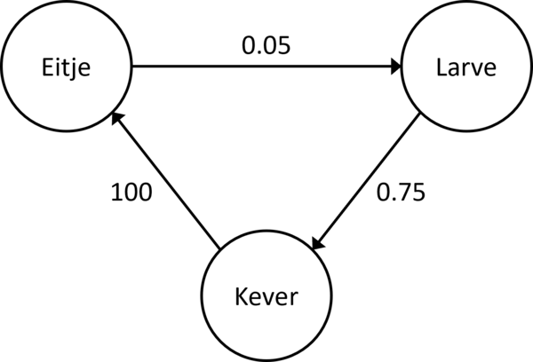

# Modelleren van de levensloop van een kever met de Lesliematrix

In de vorige modules concentreerden we ons op het aantal rupsen van de buxusmot doorheen de tijd, waarbij we een rups als een onveranderende entiteit beschouwden. In dit hoofdstuk zullen we ook rekening houden met de levensfase waarin een insect zich kan bevinden. Daarvoor zullen we de kever beschouwen, die drie verschillende levensfases doorloopt:

- De kever komt ter wereld in de vorm van een eitje
- Uit het eitje komt een larve gekropen
- De larve ontpopt zich tot een kever

Voor een bioloog is het interessant om te weten hoeveel eitjes, larven en kevers er op verschillende momenten in de tijd zijn. In dit hoofdstuk zal je leren dat deze populatiegroottes gemodelleerd kunnen worden met behulp van de **Lesliematrix**.

## Overgangen tussen levensfases

Bij kevers is de overgang van één levensfase naar een andere niet meteen evident te noemen. Zo werd er empirisch vastgesteld dat maar liefst 95% van de eitjes opgegeten wordt of nooit uitkomt. Wanneer er initieel 1000 eitjes zijn, blijven er na een maand dus slechts ongeveer 50 over! De kans dat de larve vervolgens een kever wordt is een stuk groter: maar liefst 75% van de larven ontpopt zich tot een kever. Eens ontpopt, legt de kever in een maand tijd ongeveer 100 eitjes.

Deze volgorde van levensfases leidt tot een cyclus. Deze cyclus kan in een graag gegoten worden, die de overgang tussen toestanden op een zeker moment in de tijd beschrijft:

Op basis van de waarden van de knopen in de graaf, kan de volgende toestand berekend worden. Om dit proces te vereenvoudigen, zal je matrices gebruiken.

## De Lesliematrix

Om aan matrixvermenigvuldiging te kunnen doen, stel je de toestand op tijdstip $0$ gelijk aan een vector $v_0$, die het aantal eitjes, levers en kevers bevat. Beschouw bijvoorbeeld:

\\[v_0 = \begin{bmatrix} 1000 &#92;&#92; 100 &#92;&#92; 60 \end{bmatrix}\\]

Om dan de toestand $v_{1}$ op tijdstip $1$ te bepalen, gebruik je de **Lesliematrix** $L$ die de populatiegroei beschrijft. In bovenstaand voorbeeld ziet deze er als volgt uit:

$$L = \begin{bmatrix} 0 & 0 & 100 \ 0.05 & 0 & 0 \ 0 & 0.75 & 0 \end{bmatrix}$$

Vertrek je van de toestand $v_0$, dan kan $v_{1}$ berekend worden als volgt:

$$v_{1} = L v_0 = \begin{bmatrix} 0 & 0 & 100 \\\\ 0.05 & 0 & 0 \\\\ 0 & 0.75 & 0 \end{bmatrix} \begin{bmatrix} 1000 \\\\ 100 \\\\ 60 \end{bmatrix} = \begin{bmatrix} 6000 \\\\ 50 \\\\ 75 \end{bmatrix}$$

Ga je een stap verder, dan vind je:

$$v_{2} = L v_{1} = \begin{bmatrix} 0 & 0 & 100 \\\ 0.05 & 0 & 0 \\\ 0 & 0.75 & 0 \end{bmatrix} \begin{bmatrix} 6000 \\\ 50 \\\ 75 \end{bmatrix} = \begin{bmatrix} 7500 \\\ 300 \\\ 37.5 \end{bmatrix}$$

Bemerk dat deze laatste uitdrukking ook als volgt geschreven kan worden:

$$v_{2} = L v_{1} = L L v_{0} = L^2 v_{0}$$

Om het aantal eitjes, larven en kevers in tijdstap $t$ te berekenen, volstaat het dus om de $t^\text{de}$ macht van de matrix $L$ te berekenen, en deze te vermenigvuldigen met $v_0$:

$$v_{t} = L^t v_{0}$$

## Interactieve notebook

Nu ga je aan de slag met een interactieve online notebook, waarin je Python zal gebruiken om matrixberekeningen uit te voeren en de populatiegroei grafisch te illustreren.

