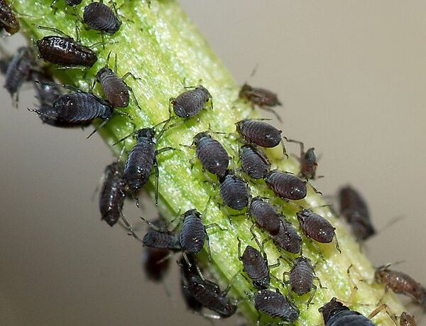

# Lieveheersbeestjes en luizenplagen: een dynamisch wereldbeeld met differentiaalvergelijkingen

Het vorig hoofdstuk was onze eerste kennismaking met (groei)modellen. Realistisch of niet, deze werden gekarakteriseerd doordat ze discreet in de tijd waren: de tijd tikte generatie per generatie voorbij. In de praktijk ervaren we tijd echter als continu: tussen vandaag en morgen zitten een oneindig aantal individuele momenten. Vandaar dat wetenschappers de realiteit vaak beschrijven door een krachtiger model: de **differentiaalvergelijking**. De oplossing van een dergelijke differentiaalvergelijking is dan geen getal, maar een functie die het systeem beschrijft doorheen de tijd. Differentiaalvergelijkingen worden doorgaans pas gegeven na een stevige wiskundebasis. In dit hoofdstuk geven we een eerste introductie tot differentiaalvergelijkingen, met als doel een populatie bladluizen en lieveheersbeestjes te beschrijven.

## Biologische bestrijding met lieveheersbeestjes

Waar rupsen ware monsters zijn die bladeren van planten opeten en gewassen op die manier aantasten, zijn bladluizen meer verfijnd. Met hun naaldvormig mondstuk zuigen ze het sap van een plant rechtstreeks uit het vaatweefsel. Dit sap bevat voornamelijk suikers, en relatief weinig aminozuren die de luizen ook nodig hebben. Daarom scheiden de luizen het sap grotendeels terug uit, ontdaan van de meeste aminozuren; deze substantie wordt honingdauw genoemd. Hoewel honingdauw een belangrijke voedingsbron voor mieren en wespen is, kan deze substantie ook schadelijke schimmels aantrekken. Bovendien onttrekken luizen via het vaatweefsel niet alleen de kostbare suikers van de plant, maar ook gevaarlijke plantenvirussen die zich op deze manier verder kunnen verspreiden. Daarom zijn luizen erg vervelende beestjes voor vele soorten gewassen, zoals aardappelen, bonen en rozen.

Omdat luizen zo schadelijk zijn, bestaan er verschillende chemische verdelgingsmiddelen. Deze behandeling kan er evenwel voor zorgen dat er schadelijke stoffen in de gewassen en de bodem terechtkomen, die slecht zijn voor mens en natuur. Daarom wordt er ook vaak een biologische bestrijding toegepast: bladluizen zijn immers smakelijk voedsel voor vele andere insecten en vogels. Het lieveheersbeestje in het bijzonder is een echte moordmachine voor bladluizen. Larven alleen al eten zo'n 400 bladluizen, terwijl een volwassen lieveheersbeestje maar liefst 5000 luizen kan verorberen. Men kan daarom de larven van lieveheersbeestjes kopen om een luizenplaag onder controle te brengen.

Wanneer men lieveheersbeestjes introduceert in de omgeving, zullen deze zich verder voortplanten. Een lieveheersbeestje kan op een dag wel 50 eitjes leggen, die eerst larven worden, en zich na ongeveer 20 dagen verpoppen tot nieuwe lieveheersbeestjes. Dit betekent dat de populatie zal aangroeien zolang er voldoende voedsel is. Wanneer er op een gegeven moment te weinig bladluizen over zijn, zal het aantal lieveheersbeestjes weer dalen.

**Om de effecten van biologische bestrijding te modelleren, heb je dus een complexer model nodig dan deze die je hiervoor behandeld hebt**. Je zal namelijk twee toestanden moeten modelleren: het aantal bladluizen en het aantal lieveheersbeestjes.

## Interactieve notebook

Nu ga je aan de slag met een interactieve online notebook, waarin je Python zal gebruiken om de interactie tussen de populatiegroottes van bladluizen en lieveheersbeestjes in kaart te brengen.

