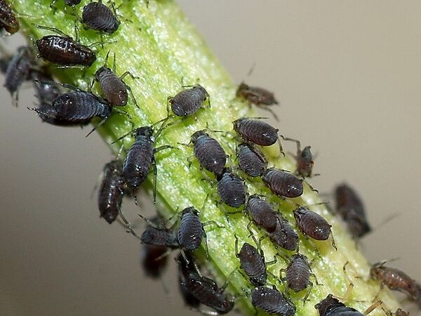
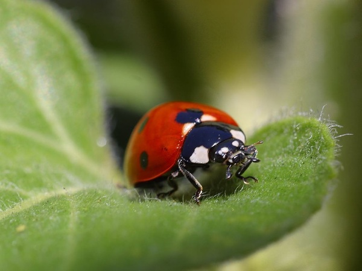

# Lieveheersbeestjes en luizenplagen: een dynamisch wereldbeeld met differentiaalvergelijkingen

We stelden reeds vast dat de tijd in de praktijk als continu ervaren wordt, waarbij discrete groeimodellen niet lang volstaan. Daarom beschrijven wetenschappers de realiteit vaak door een krachtiger model: de **differentiaalvergelijking**. De oplossing van een dergelijke differentiaalvergelijking is dan geen getal, maar een functie die het systeem beschrijft doorheen de tijd. Differentiaalvergelijkingen worden doorgaans pas gegeven na een stevige wiskundebasis. In deze module geven we een eerste introductie tot differentiaalvergelijkingen, met als doel een populatie bladluizen en lieveheersbeestjes te beschrijven.

## Biologische bestrijding met lieveheersbeestjes

Waar rupsen ware monsters zijn die bladeren van planten opeten en gewassen op die manier aantasten, zijn bladluizen meer verfijnd. Met hun naaldvormig mondstuk zuigen ze het sap van een plant rechtstreeks uit het vaatweefsel. Dit sap bevat voornamelijk suikers, en relatief weinig aminozuren die de luizen ook nodig hebben. Daarom scheiden de luizen het sap grotendeels terug uit, ontdaan van de meeste aminozuren; deze substantie wordt honingdauw genoemd. Hoewel honingdauw een belangrijke voedingsbron voor mieren en wespen is, kan deze substantie ook schadelijke schimmels aantrekken. Bovendien onttrekken luizen via het vaatweefsel niet alleen de kostbare suikers van de plant, maar ook gevaarlijke plantenvirussen die zich op deze manier verder kunnen verspreiden. Daarom zijn luizen erg vervelende beestjes voor vele soorten gewassen, zoals aardappelen, bonen en rozen.

Omdat luizen zo schadelijk zijn, bestaan er verschillende chemische verdelgingsmiddelen. Deze behandeling kan er evenwel voor zorgen dat er schadelijke stoffen in de gewassen en de bodem terechtkomen, die slecht zijn voor mens en natuur. Daarom wordt er ook vaak een biologische bestrijding toegepast: bladluizen zijn immers smakelijk voedsel voor vele andere insecten en vogels. Het lieveheersbeestje in het bijzonder is een echte moordmachine voor bladluizen. Larven alleen al eten zo'n 400 bladluizen, terwijl een volwassen lieveheersbeestje maar liefst 5000 luizen kan verorberen. Men kan daarom de larven van lieveheersbeestjes kopen om een luizenplaag onder controle te brengen.

Wanneer men lieveheersbeestjes introduceert in de omgeving, zullen deze zich verder voortplanten. Een lieveheersbeestje kan op een dag wel 50 eitjes leggen, die eerst larven worden, en zich na ongeveer 20 dagen verpoppen tot nieuwe lieveheersbeestjes. Dit betekent dat de populatie zal aangroeien zolang er voldoende voedsel is. Wanneer er op een gegeven moment te weinig bladluizen over zijn, zal het aantal lieveheersbeestjes weer dalen.

**Om de effecten van biologische bestrijding te modelleren, heb je dus een complexer model nodig dan deze die je hiervoor behandeld hebt**. Je zal namelijk twee toestanden moeten modelleren: het aantal bladluizen en het aantal lieveheersbeestjes.

## De populatiegrootte als differentiaalvergelijking

In deze module zal je het concept van afgeleiden gebruiken om de verandering van de populatiegrootte van bladluizen en lieveheersbeestjes te beschrijven, waarbij de ene populatiegrootte een rechtstreekse impact heeft op de andere. Hiervoor zal je een vergelijking gebruiken waarbij zowel een functie als haar afgeleide voorkomt; dit wordt een **differentiaalvergelijking** genoemd.

Eigen aan differentiaalvergelijkingen is dat de afgeleide van een functie, genoteerd als \\(\dot{y}\\), geschreven kan worden als een functie van de originele functie \\(y\\) op een specifiek moment in de tijd \\(t\\):

\\[\dot{y} = f(y, t)\\]

Specifiek gericht op het probleem met bladluizen, kan je de groei van de populatiegrootte van luizen als volgt beschrijven:

\\[\dot{y} = ry \left(1 - \frac{y}{K}\right)\\]

Hierbij stellen \\(r = a - 1\\) het groeipercentage en \\(K\\) de draagkracht voor (beide strikt positieve constanten), en stelt \\(y\\) de populatiegrootte voor. \\(\dot{y}\\) is dan de afgeleide van \\(y\\), die je iets vertelt over de verandering van de populatiegrootte:

- Wanneer \\(\dot{y} > 0\\), zal de populatiegrootte stijgen
- Wanneer \\(\dot{y} < 0\\), zal de populatiegrootte dalen
- Wanneer \\(\dot{y} = 0\\), zal er geen verandering zijn en blijft de populatiegrootte constant

Belangrijk is dus om vast te stellen dat \\(\dot{y}\\) de verandering (groei/afname) van de populatiegrootte beschrijft, en niet de populatiegrootte zelf!

Je kunt je de vraag stellen wanneer het systeem in evenwicht is, en de populatiegrootte dus constant blijft. In dat geval moet je volgende vergelijking oplossen:

\\[\dot{y} = 0 \iff ry \left(1 - \frac{y}{K}\right) = 0 \iff ry = 0 \lor 1 - \frac{y}{K} = 0 \iff y = 0 \lor y = K\\]

In het eerste geval zijn er geen bladluizen, in het tweede geval wordt de draagkracht \\(K\\) bereikt (zie eerder).

De bedoeling is nu om het verloop van de populatiegrootte te kunnen beschrijven doorheen de tijd. Hiervoor kan je de **methode van Euler** gebruiken, die toelaat om een numerieke oplossing te berekenen van een differentiaalvergelijking met beginvoorwaarden. Herinner je dat je de afgeleide van een functie als volgt kan benaderen:

\\[f'(t) \approx \frac{f(t + \Delta t) - f(t)}{\Delta t}\\]

met \\(\Delta t\\) zo klein mogelijk. Je vindt dan dat:

\\[f(t + \Delta t) \approx f(t) + \Delta t \cdot f'(t)\\]

In het beschouwde geval stelt \\(y = f(t)\\) de populatiegrootte voor, en \\(\dot{y} = f'(t)\\) de verandering van deze grootte. In de interactieve notebook zal je deze laatste formule gebruiken om stap voor stap nieuwe schattingen voor de functie \\(f\\) te maken.

## Interactieve notebook

Ga nu aan de slag met een interactieve notebook, waarin je Python zal gebruiken om de interactie tussen de populatiegroottes van bladluizen en lieveheersbeestjes in kaart te brengen.

