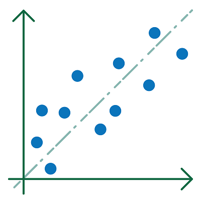

# Machine learning

Machinaal leren (ML) is een populair en succesvol onderdeel van de artificiële intelligentie. Bij *machine learning* gaat men vooral proefondervindelijk te werk, maar op een wiskundig onderbouwde manier, en gebruikmakend van principes uit de wiskundige statistiek (Chollet, 2018). 

Een mens ontwikkelt het AI-systeem. In dat systeem verwerkt hij parameters waarvan de waarden nog niet vastliggen. 
Gedurende de training leert het systeem, d.w.z. dat het systeem a.d.h.v. een lerend algoritme op zoek gaat naar de optimale waarden voor die parameters. 
Na de training zijn deze waarden bepaald en beschikt men over een ML-model: een ML-systeem dat klaar is voor gebruik.    

**Een machine learning-systeem verwerft met lerende algoritmes kennis uit data met de bedoeling uitkomsten te kunnen voorspellen betreffende nieuwe data.** 

- De nieuwe data moeten wel gelijkaardig zijn aan de aangeboden data. 
- Deze voorspellingen worden gedaan met een bepaalde zekerheid. Zulke ML-modellen zullen dus nooit honderd procent accuraat zijn.

    Lerende algoritmes zijn algoritmes waarbij het ML-systeem zelf gaandeweg aanpassingen doet aan de aanwezige parameters tijdens het leerproces, om geleidelijk aan te komen tot betere prestaties. 

> Een ML-systeem neemt zijn beslissingen dus niet op basis van vooraf in detail geprogrammeerde instructies. 

De beslissingen van een ML-model worden *voorspellingen* genoemd.

### Regressie en classificatie

    Het voorspellen gebaseerd op tendensen is een <b>regressieprobleem</b>.  
    Het voorspellen van een klasse is een <b>classificatieprobleem</b>.  
    <b>Voorspellen</b> betekent bijvoorbeeld dat er uit voorbije tendensen cijfers voor de toekomst gegenereerd worden (regressie) of dat een object bij een bepaalde categorie (klasse genoemd) wordt ingedeeld (classificatie).

> In plaats van categorieën spreekt men in deze context eerder van klassen.
 
> **Concrete voorbeelden van regressie:**  
> - de prijs van een appartement voorspellen of beslissen (gebaseerd op de prijzen van appartementen die reeds verkocht zijn); 
> - uit het zeeniveau van de voorbije decennia in Oostende, het zeeniveau van de komende jaren afleiden.  

> **Concrete voorbeelden van classificatie:**  
> - bepalen of een e-mail al dan niet spam is;  
> - van een foto kunnen zeggen of er al dan niet een huidmondje op staat.

 
<figure>
    <figcaption align = "center">Regressie.</figcaption>
</figure> 

 
<figure>
    <figcaption align = "center">Classificatie.</figcaption>
</figure> 
