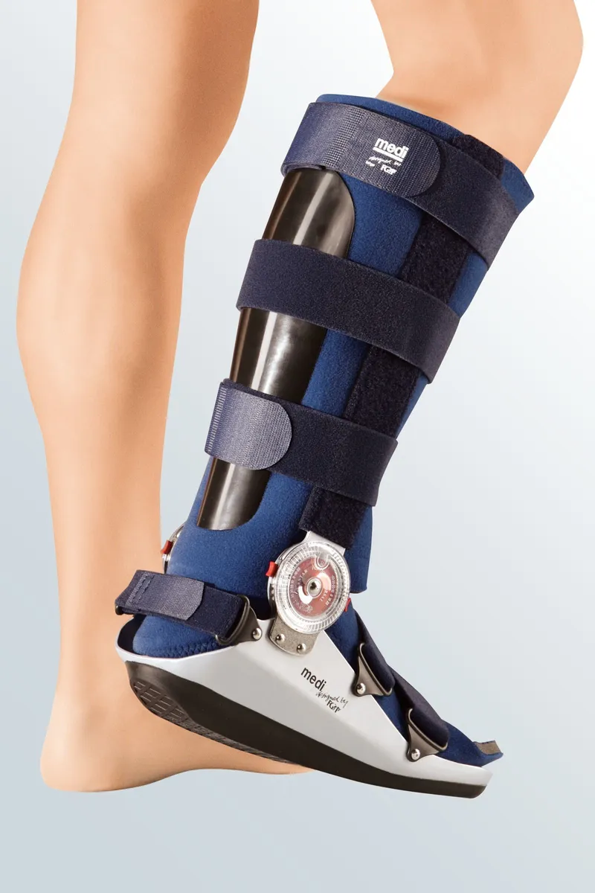
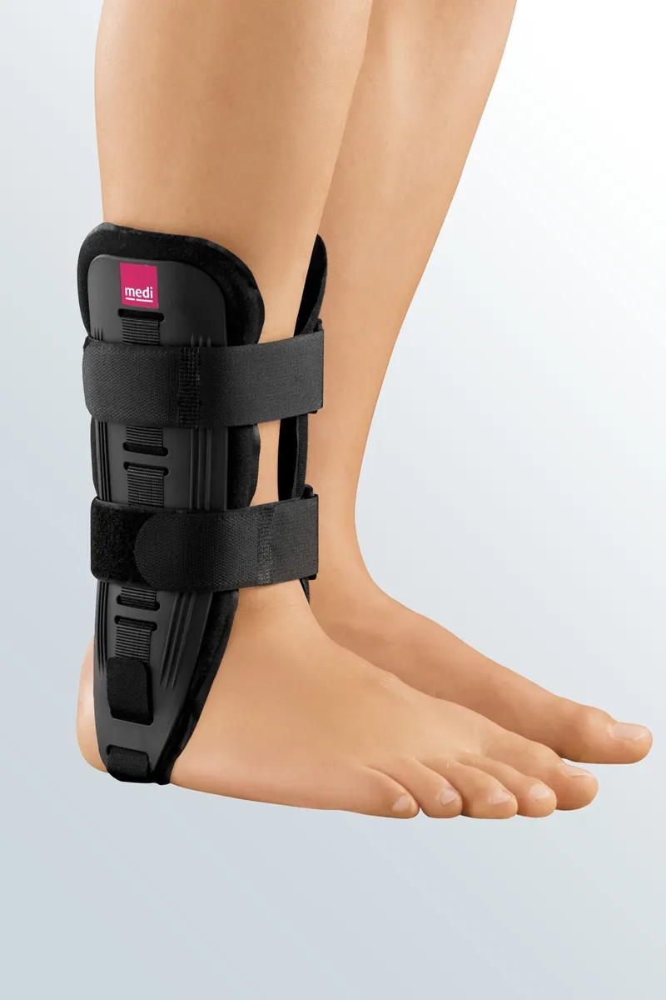
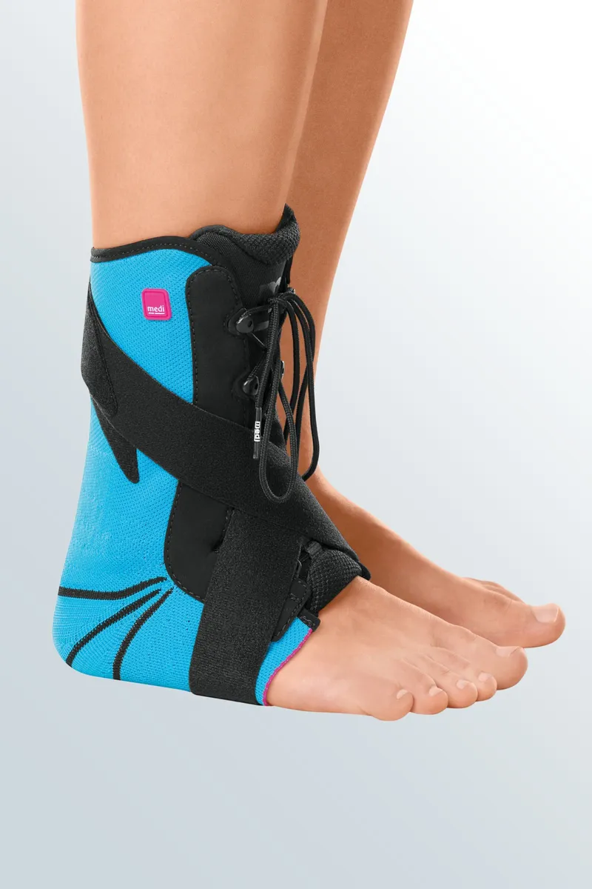

# Enkel-voet-ortheses
Vandaag de dag zijn er al een heel aantal ortheses op de markt, die proberen om aan zoveel mogelijk criteria te voldoen. De ene orthese houdt al wat meer rekening met eerder genoemde criteria dan de andere. 

We bekijken enkele ortheses die nu op de markt zijn. Onderaan vind je een overzicht met de verschillende eigenschappen per criterium van de ortheses.

**Malleloloc-L (van Bauerfeind)**

[www.bauerfeind.nl](https://www.bauerfeind.nl/nl_nl/producten/braces/enkelbrace/details/product/malleoloc-l)

**ROM Walker (van Medi)**

[www.medibelgium.be](https://www.medibelgium.be/producten/medi-rom-walker/)

**M.Step (van Medi)**

[www.medibelgium.be](https://www.medibelgium.be/producten/m-step/)

**Stabili-tri (van Levamed)**

[www.medibelgium.be](https://www.medibelgium.be/producten/levamed-stabili-tri/)

**EXO-L:**
[www.exo-l.com](https://www.exo-l.com/nld/)

**B2-Foot AFO (van Spentys):**
[www.spentys.com](https://www.spentys.com/social-sharing/b2)

# Eigenschappen huidige ortheses
De ortheses die vandaag op de markt zijn hebben allemaal andere eigenschappen. In onderstaande tabel kan je de eigenschappen van iedere orthese vinden. We bespreken eerst kort even wat deze eigenschappen inhouden:
* **Stabilisatie letsel**: patiënten gebruiken de orthese om te revalideren. Afhankelijk van de 'graad' van het letsel duurt de revalidatie korter of langer. Een letsel van de eerste graad heeft een revalidatie van 2-10 dagen, van de tweede graad 4-6 weken en een letsel van de derde graad 6-8 weken. Een eerste graadsletsel is meestal een verstuiking, terwijl bij de tweede en derde graad één of meerdere ligamenten gescheurd zijn.
* **Prijs**: dit is hoeveel de orthese kost
* **Materiaal**: een orthese moet gemaakt zijn uit het juiste materiaal. Een volledig metalen orthese is té zwaar om mee rond te lopen, terwijl een wollen orthese dan weer geen stabiliteit biedt. Bij de huidige ortheses wordt vooral gebruik gemaakt van kunststoffen.
* **Instelbaarheid**: een orthese die meer instelbaar is, is multifunctioneler. Ze kan dus ingesteld worden afhankelijk van het het type letsel en/of schoen.
* **Op maat van de patiënt**: net zoals een schoen, een t-shirt of een trui heeft een orthese een bepaalde maat. Sommige ortheses hebben maar één maat, terwijl andere volledig op maat van de patiënt zijn. 

De eigenschappen van deze enkel-voet-ortheses kan je vinden in onderstaande tabel: 
|                                      | **Malleloc-L**                        | **ROM Walker**                                                  | **M.Step**                                                                  | **Stabili-tri**                                                             | **EXO-L**                                 | **B2-foot**                                           |
|--------------------------------------|---------------------------------------|-----------------------------------------------------------------|-----------------------------------------------------------------------------|-----------------------------------------------------------------------------|-------------------------------------------|-------------------------------------------------------|
| **Stabilisatie letsel**              | Graad 1                               | Graad 2-3                                                       | Graad 2 (3 op einde revalidatie na  eerdere behandeling met andere orthese) | Graad 2 (3 op einde revalidatie na  eerdere behandeling met andere orthese) | Graad 1: preventie                        | Graad 2-3                                             |
| **Prijs (euro)**                     | 85                                    | 253.8                                                           | 80                                                                          | 184.95                                                                      | 169                                       | 100                                                   |
| **Materiaal**                        | polyurethaan en polyester                       | Aluminium, polyurethaan en katoen                                         | polyurethaan en polyester                                                             | polyamide, polyester en elastaan                                                   | polypropeen en katoen                              | Polypropyleen en polyactide                                  |
| **Instelbaarheid & compatibiliteit** | Compatibel met verschillende schoenen | 7 mogelijke bewegingsbegrenzingen.  Niet compatibel met schoen. | Slank design, niet instelbaar. Compatibel met schoen.                       | 3 mogelijke bewegingsbegrenzingen.  Niet compatibel met schoen.             | Te combineren met verschillende schoenen. | Slank design, niet instelbaar. Gebruik zonder schoen. |
| **Op maat van de patiënt**           | 1 universele maat.                    | 3 verschillende maten.                                          | 2 verschillende maten.                                                      | 4 verschillende maten.                                                      | Op maat gemaakt aan de hand van 3D-scan.  | Productie aan de hand van 3D-scan.                    |
