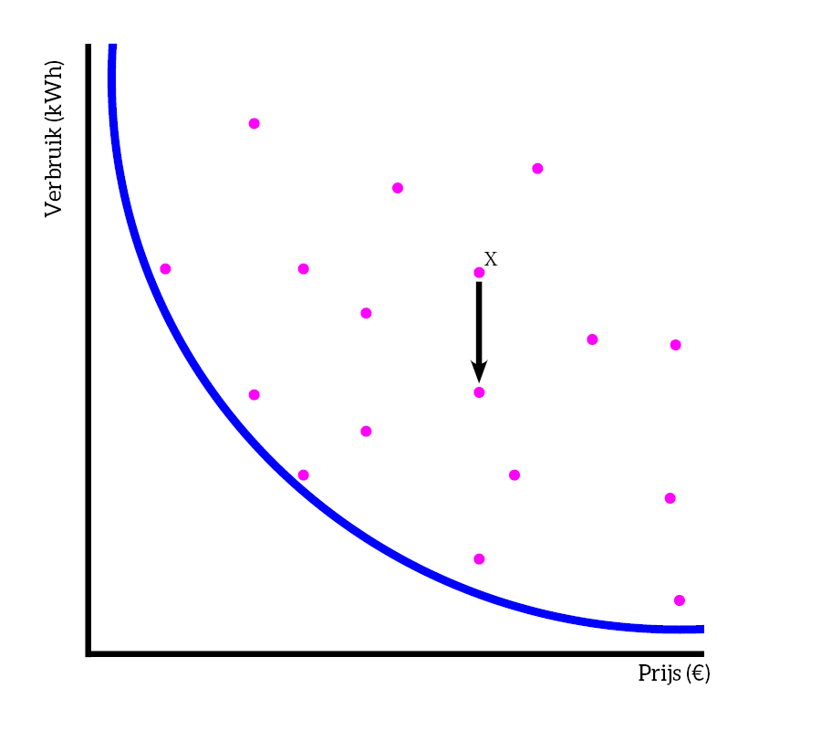
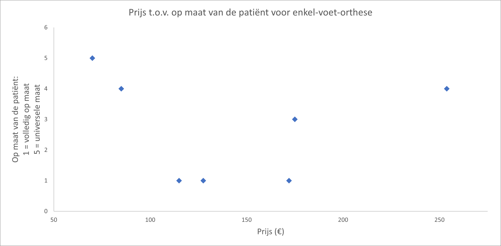
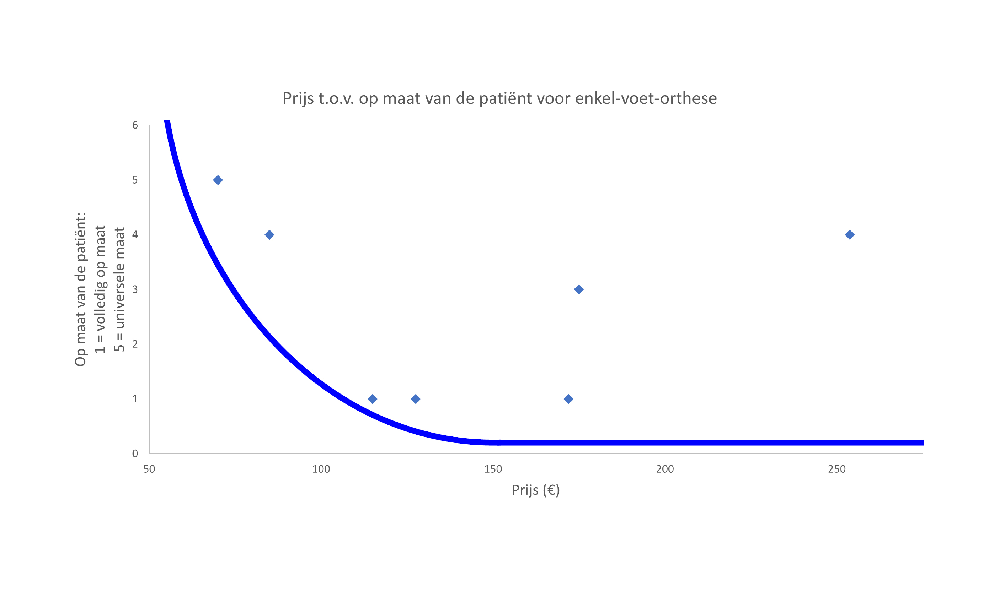
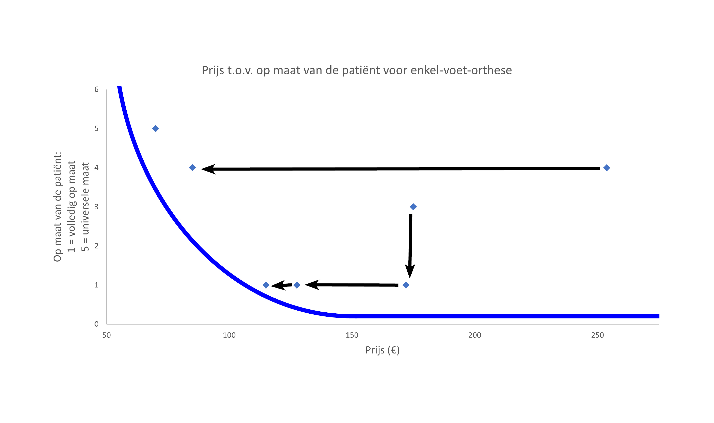
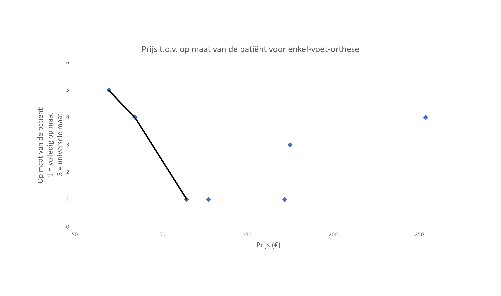

# Is er een ideale orthese?
We spitsen ons nu toe op twee criteria. Op basis daarvan kunnen we de zogenaamde pareto-curve maken (een curve met een pareto front). Dit is een typische ingenieurs tool om een beslissing te nemen in een situatie waarbij twee criteria elkaar beïnvloeden. 
te maken waarbij twee criteria elkaar beïnvloeden. 

Om dit beter te begrijpen bekijken we eerst het voorbeeld van een koelkast:
Stel we willen verschillende koelkasten vergelijken, iedere koelkast heeft een prijs en heeft ook een verbruik (in kWh). Als we de koelkasten uitzetten in een grafiek zien we het volgende:

De blauwe lijn verbindt eigenlijk de meest extreme punten (een héél goedkope koelkast die veel verbruikt én een héél dure koelkast die weinig verbruikt). 

Op basis van de grafiek zie je ook dat er een heleboel ‘sub-optimale’ punten zijn, beter gezegd koelkasten die niet interessant zijn om te kopen. Neem nu onderstaand voorbeeld:

Koelkast X is niet ideaal, voor dezelfde prijs kunnen we ook een koelkast bemachtigen die véél minder verbruikt. Het meest optimale punt is in dit geval het punt dat zo dicht mogelijk bij het Pareto-front (de blauwe lijn) ligt. 

Het effectieve pareto-front is geen mooie kromme maar verbindt de optimale punten met elkaar. Het geeft je de mogelijkheid om je aandacht te berpeken om een efficiënte afweging te maken, in plaats van naar een volledige dataset te kijken en het volledig bereik van elke parameter in overweging te nemen.
Voor de koelkast krijgen we dan het volgende: 

Deze punten zijn allemaal haalbare keuzes, afhankelijk van je eigen vereisten kan je het best hier eentje uit kiezen.

We keren terug naar onze enkel-voet-ortheses. We willen namelijk de beste keuze maken. 
We hebben twee criteria nodig om de pareto-curve te kunnen opstellen. We kiezen hierbij voor 'prijs' en 'op maat van de patiënt', twee criteria die van belang zijn voor de patiënt'. Merk op dat we nu het omgekeerde moeten nemen voor ‘maat’, omdat we willen dat een lage score overeenkomt met ‘volledig op maat van de patiënt gemaakt’. In een pareto-cruve is het meest ideale namelijk een lage prijs en een volledig op maat van de patiënt (een lage score dus).
|                 | **Malleloc-L** | **ROM Walker** | **M-step** | **Stabili-tri** | **EXO-L** | **B2-foot** | **Zeepaardje orthese** |
|-----------------|----------------|----------------|------------|-----------------|-----------|-------------|------------------------|
| Prijs           | 70             | 253.8          | 85         | 175             | 172       | 115         | 127.5 | 
| Maat            | 1              | 2              | 2          | 3               | 5         | 5           | 5 |
| Maat (inverse)  | 5              | 4              | 4          | 3               | 1         | 1           | 1 |

Hiervan maken we vervolgens een plot met de verschillende punten:

Stel we bekijken nu de twee meest extreme punten: een heel goedkope orthese maar wel maar één universele maat én een heel dure orthese die wel volledig op maat is van de patiënt. Dan bekomen we, theoretisch, het volgende als we deze punten verbinden:

We gaan op zoek naar het meest ‘ideale’ punt. Deze ligt zo dicht mogelijk tegen het blauwe pareto-front. Alle andere punten noemen we suboptimale punten. Want voor deze sub-optimale punten is er telkens een ander punt dat ofwel goedkoper ofwel meer op maat van de patiënt is. Dit is duidelijk in onderstaande figuur:

Hieruit kunnen we concluderen dat de orthese gebaseerd op het zeepaardje niet de ‘beste’ is. Er zijn enkele suboptimale ortheses, die dat op het pareto-front liggen kunnen we als een nuttige piste beschouwen. 

Het is belangrijk om op te merken dat dit voorbeeld een vereenvoudiging is van de realiteit en er dus nog een aantal stappen moeten genomen worden alvorens dit soort ortheses een echte plaats kan krijgen op de markt. In werkelijkheid moet er bij de afweging met veel meer factoren rekening worden gehouden dan enkel 'prijs' en 'op maat van de patiënt'.

### Oefening: jouw ideale Smartphone!
Je kiest je nieuwe Smartphone nu misschien alleen op basis van de prijs of op basis van de kleur. Maar, dan heb je misschien niet altijd alles uit de prijs gehaald die je ervoor betaalde.
* Bepaal wat voor jou belangrijk is aan een Smartphone: kies twee criteria die jij belangrijk vindt. Vind je de prijs belangrijk? Of toch maar hoe lang het duurt voordat je Smartphone volledig is opgeladen? Misschien vind je de duurzaamheid van je Smartphone wel belangrijk? 
* Zoek enkele (minstens 10) Smartphone's op via het internet en zoek de eigenschappen van de twee criteria die jij voorop stelde. 
* Maak uit je tabel een pareto-front en je komt helemaal te welke Smartphones ideaal zijn voor jou, of beter: welke je beter niét koopt!

