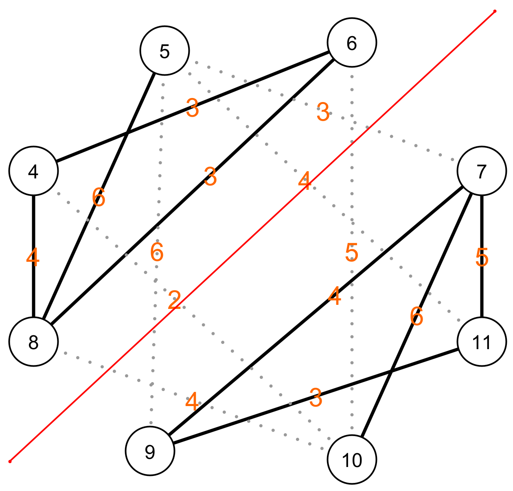

# Herformuleren van het probleem

Nu we een **abstracte voorstelling** hebben van de verplaatsingen tussen de verschillende verdiepingen, kunnen we het vraagstuk in functie daarvan herformuleren:

> Hoe knip je een graaf in twee gelijke stukken zodat de som van het aantal bogen dat je doorknipt zo klein mogelijk is?

|  |  |
| - | - |
| Hier zie je een voorbeeld van hoe we de graaf in twee gelijke stukken kunnen knippen. De rode lijn stelt de lijn voor langs waar we de graaf in twee knippen. Elke boog die de lijn kruist, knippen we door. De totale kost van de knip is dan de som van de gewichten van alle bogen die we doorknippen.  |  |
|  |  |
| Op deze afbeelding zie je de bogen die doorgeknipt worden, deze worden voorgesteld door een stippellijn. Deze verzameling van bogen noemen we een knip. De totale kost van deze knip is de som van de gewichten op de stippellijnen. 3 + 5 + 4 + 2 + 6 + 4 = 24 |  |
|  |  |

Om ons probleem op te lossen, zoeken we dus een knip van de graaf met een minimale kost.

Ons probleem is nog niet opgelost, daar moeten we eigenlijk nog aan beginnen. Tot nog toe hebben we, door gebruik te maken van abstractie en patroonherkenning, het probleem omgevormd naar een structuur waar een computer gemakkelijk mee overweg kan. Dit is de essentie van computationeel denken. We vormen een probleem om zodat het makkelijker is om over na te denken, alsook om op te lossen met de computer. 

