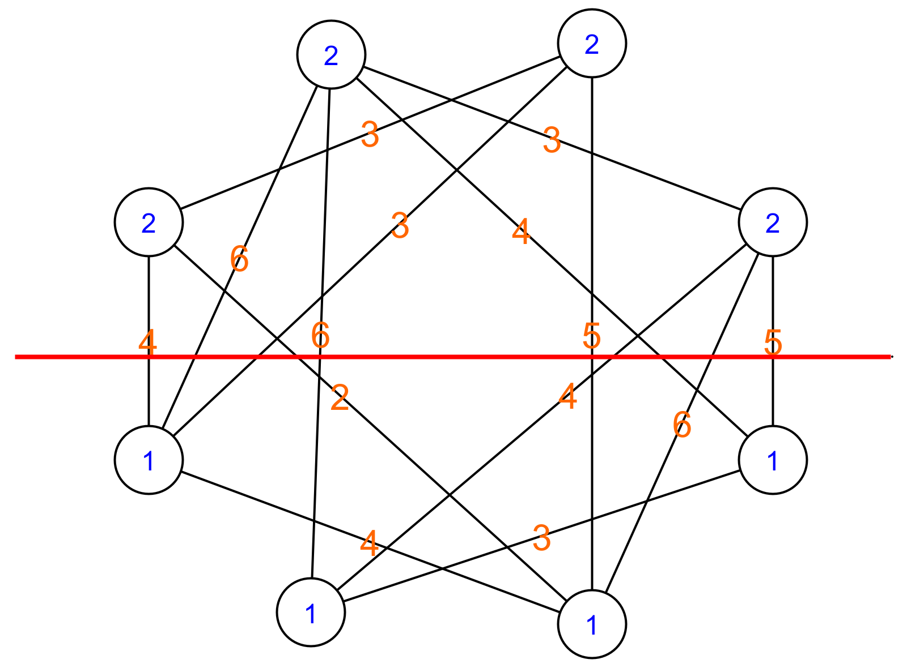

# Brute kracht

## Kost berekenen van de knip

Nu we alle mogelijke verdelingen hebben van de graaf, is het eenvoudig om de kost van zo'n verdeling te berekenen. We overlopen simpelweg alle bogen in de graaf. Als die aan dezelfde lift zijn toegekend, doen we niets. Als die aan een verschillende lift zijn toegekend, tellen we de kost van die boog op bij de totale kost van de knip. Hieronder zie je een voorbeeld van een verdeling van de graaf met ook de plaats waar de graaf in twee geknipt zal worden.

 

 De volgende Python code berekent de knipkost voor een bepaalde verdeling. We maken daarvoor gebruik van de bogenmatrix die we eerder hebben opgesteld.

```python
bogen_matrix = np.array([
    [0, 0, 3, 0, 4, 0, 2, 0],
    [0, 0, 0, 3, 6, 6, 0, 4],
    [0, 0, 0, 0, 3, 0, 5, 0],
    [0, 0, 0, 0, 0, 4, 6, 5],
    [0, 0, 0, 0, 0, 0, 4, 0],
    [0, 0, 0, 0, 0, 0, 0, 3],
    [0, 0, 0, 0, 0, 0, 0, 0],
    [0, 0, 0, 0, 0, 0, 0, 0]])


# Bereken de kost om een bepaalde verdeling van de graaf in twee te knippen
def knip_kost(verdeling_verdiepingen):
    # De kost is de som van alle bogen die de twee delen van de graaf 
    # met elkaar verbinden, deze start op 0.
    kost = 0
    # Overloop elke mogelijke combinatie van vertrek en aankomstverdieping.
    for vertrekverdieping in range(len(verdeling_verdiepingen)):
        for aankomstverdieping in range(len(verdeling_verdiepingen)):
            # Als de vertrek en aankomstverdieping niet aan dezelfde lift zijn toegekend, 
            # tel dan de kost van de boog op bij de totale kost.
            if verdeling_verdiepingen[vertrekverdieping] != verdeling_verdiepingen[aankomstverdieping]:
                kost += bogen_matrix[vertrekverdieping][aankomstverdieping]
    return kost # Geef de totale kost terug
```
