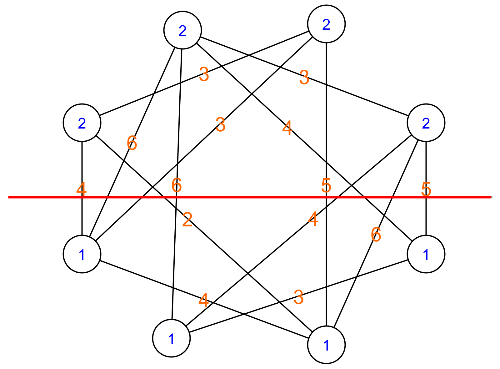

# Brute kracht
## De knip met laagste kost zoeken

Deze laatste stap is de eenvoudigste. Hiervoor overlopen we de lijst van alle mogelijke keuzes om de liften te verdelen over de verdiepingen en berekenen we de kost van die keuze. In de lijst van kosten zoeken we de minimale kost. Hieronder zien we een voorbeeld van zo'n toekenning van de knopen aan een groep. We zien ook welke knip deze toekenning dan oplevert.

 

 De volgende Pythoncode berekent de knip kost voor een bepaalde verdeling. We maken daarvoor gebruik van de bogenmatrix die we eerder hebben opgesteld.

```python
 # Genereer alle mogelijke verdelingen van de verdiepingen over de liften
alle_mogelijke_keuzes = genereer_alle_mogelijke_keuzes(4, 8)

# Bereken de kost van elke mogelijke verdeling
knip_kosten = [knip_kost(keuze) for keuze in alle_mogelijke_keuzes] 

# Kies een arbitrair grote kost om te starten
minimale_kost = 100000 
index_minimale_kost = 0

for i, val in enumerate(knip_kosten):
    # Als de kost van de huidige verdeling kleiner is dan de minimale kost tot nu toe.
    if knip_kosten[i] < minimale_kost:
        # Neem de huidige verdeling als de nieuwe minimale kost.
        index_minimale_kost = i
        minimale_kost = knip_kosten[i]
               
print("De minimale kost is: ", minimale_kost)
print("De verdeling van de verdiepingen over de liften is: ", alle_mogelijke_keuzes[index_minimale_kost])
```

Als we deze code uitvoeren, krijgen we het volgende resultaat:

De minimale kost is: 12
De verdeling van de verdiepingen over de liften is: [1, 2, 1, 2, 1, 2, 1, 2]

De optimale verdeling is dus om lift 1 op de even verdiepingen te laten stoppen en lift 2 op de oneven verdiepingen. In dit geval moeten gemiddeld 12 mensen per dag de trap nemen. Merk op dat er nog een verdeling is met minimale kost. Deze is de tegenovergestelde verdeling [2, 1, 2, 1, 2, 1, 2, 1].