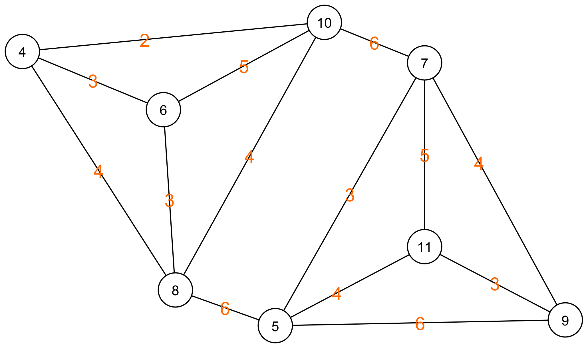

# Algoritme van Karger

Voor het bepalen van de minimale knip van een graaf bestaat ook een Monte Carlo algoritme. Dit wordt het algoritme van Karger genoemd (naar de uitvinder David Karger). Hieronder leggen we stap voor stap uit hoe dit algoritme werkt.

Het algoritme van Karger zal de graaf die in stukken geknipt moet worden, reduceren tot een graaf met maar twee knopen. De kost om die graaf in twee te knippen is dan de som van alle bogen die die twee knopen verbinden. Deze som is wat het algoritme gokt dat de minimale kost is. Deze procedure wordt een aantal keer herhaald waarna de beste gok gekozen wordt als finaal resultaat. Hieronder zie je een voorbeeld van hoe de graaf gereduceerd kan worden.

|  |  |
| - | - |
| We starten met de volledige graaf. |  |
|  |  |
| We kiezen een willekeurige boog en de twee knopen die aan die boog grenzen. |  |
|  |  |

