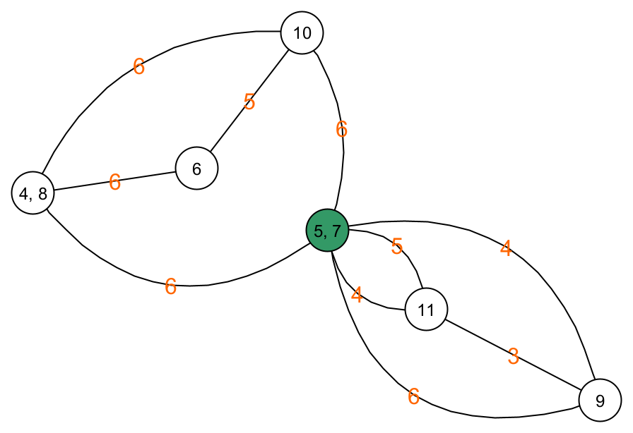
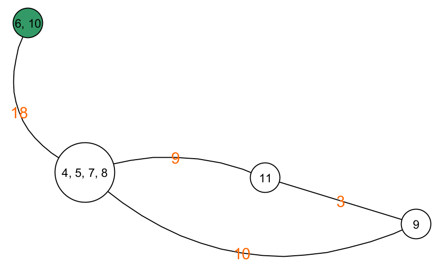
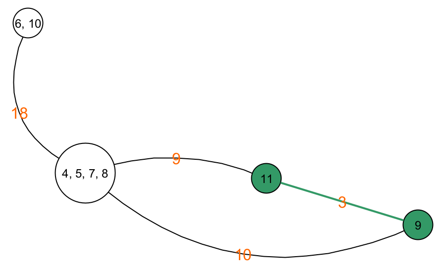
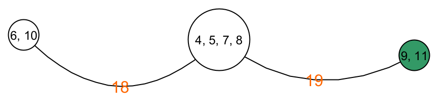

# Monte Carlo

## Algoritme van Karger

Voor het bepalen van de minimale knip van een graaf bestaat ook een Monte Carlo algoritme. Dit wordt het algoritme van Karger genoemd (naar de uitvinder David Karger). Hieronder leggen we stap voor stap uit hoe dit algoritme werkt.

Het algoritme van Karger zal de graaf die in stukken geknipt moet worden, reduceren tot een graaf met maar twee knopen. De kost om die graaf in twee te knippen is dan de som van alle bogen die die twee knopen verbinden. Deze som is wat het algoritme gokt dat de minimale kost is. Deze procedure wordt een aantal keer herhaald waarna de beste gok gekozen wordt als finaal resultaat. Hieronder zie je een voorbeeld van hoe de graaf gereduceerd kan worden.

|  | 

 |
| - | -- |
| We starten met de volledige graaf. |  |
|  |  |
| We kiezen een willekeurige boog en de twee knopen die aan die boog grenzen. |  |
|  |  |
| We voegen de twee knopen samen door de boog die ze verbindt, weg te laten. Alle andere bogen die uit een van de twee knopen vertrokken, vertrekken nu uit de gecombineerde knoop. |  |
|  |  |
| Als er knopen zijn waartussen er meerdere bogen lopen, vervangen we deze bogen door één boog. Het gewicht van deze boog is gelijk aan de som van de gewichten van de bogen die we vervangen. Tussen knoop (4, 8) en knoop (6) zijn er bijvoorbeeld twee bogen met gewicht 3. Deze vervangen we door één boog met gewicht 6. |  |
|  |  |
| Daarna kiezen we opnieuw een willekeurige boog. |  |
|  |  |
| De aangrenzende knopen van deze boog voegen we opnieuw samen. |  |
|  |  |
| En we reduceren weer dubbele bogen tussen twee dezelfde knopen. |  |
|  |  |
| Dit blijven we herhalen tot er slechts 2 knopen over blijven. Boog selecteren. |  |
|  |  |
| Knopen samenvoegen. |  |
|  |  |
| Bogen reduceren. |  |
|  |  |
| Boog selecteren. |  |
|  |  |
| Knopen samenvoegen en bogen reduceren. |  |
|  |  |
| Boog selecteren. |  |
|  |  |
| Knopen samenvoegen en bogen reduceren. |  |
|  |  |
| Boog selecteren. |  |
|  |  |
| Knopen samenvoegen en bogen reduceren. |  |

Na deze reductie is onze gok voor de minimale knip het gewicht van de boog tussen de twee resterende nodes. In dit geval dus 22. **Merk op dat dit algoritme er niet voor zorgt dat de verdeling van de knopen in te twee delen van de knip gelijk is.** In ons geval zitten er 6 knopen in de ene graaf en twee knopen in de andere. 

