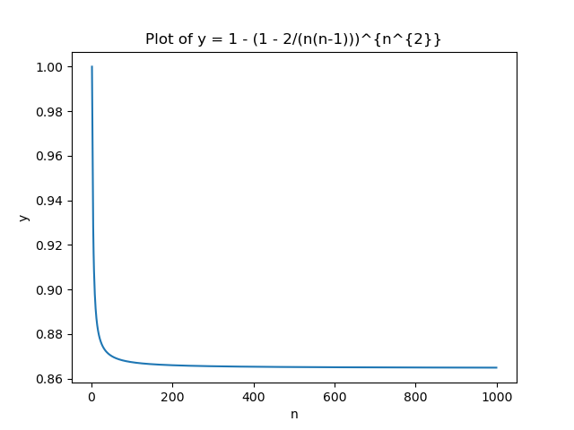

# Monte Carlo

## Algoritme van Karger: theorie

We hebben nu een techniek om te gokken wat de minimale knip van de graaf zou kunnen zijn. Nu is de vraag natuurlijk wat de kans is dat we juist gokken. Als die heel klein is, zullen we heel veel moeten gokken om tot een juiste oplossing te komen. Hoe groter de kans op een juiste gok, hoe minder we moeten gokken. Men kan bewijzen dat de kans dat deze gok correct is, gelijk is aan: \\[\dfrac{2}{n(n-1)}\\] Als we dus \\(K\\) keer gokken, zullen we op zijn minst met de volgende kans de minimale knip vinden: \\[1-\left(1-\dfrac{2}{n(n-1)}\right)^K\\]

Als we het aantal pogingen gelijk stellen aan \\(n^2\\), dan kunnen we de kans dat we voor grote grafen een correcte oplossing vinden, schatten door de limiet te berekenen.

\\[\lim_{n \to +\infty}\left[1-\left(1-\dfrac{2}{n(n-1)}\right)^{n^2}\right] \approx 1 - \dfrac{1}{e} \approx 0.63\\]

Plotten we de kans voor \\(n\\) van \\(2\\) tot \\(1000\\), krijgen we de volgende grafiek. We zien hier dat voor alle waardes van \\(n <= 1000\\), de kans dat we met ons algoritme het correcte antwoord vinden, groter is dan 86%.

Om de totale algoritmische complexiteit te berekenen, kunnen we nu het aantal pogingen dat we moeten doen, in dit geval \\(n^2\\), berekenen. Vermenigvuldigen met de complexiteit om een gok te doen. Hiervoor moeten we \\(n-2\\) reductiestappen uitvoeren (de graaf wordt telkens \\(1\\) knoop kleiner na een reductiestap). In een reductiestap zelf moeten we hoogstens \\(2(n-2)\\) bogen reorganiseren (in het geval van een complete graaf). De kost van de reductiestap is dus \\(2(n-2)^2\\) ofwel \\(O(n^2)\\). De totale complexiteit van ons algoritme is dus \\(2n^2(n-2)^2\\) ofwel \\(O(n^4)\\). We hebben dus een polynomiaal algoritme dat met een grote kans tot een juiste oplossing komt.  

