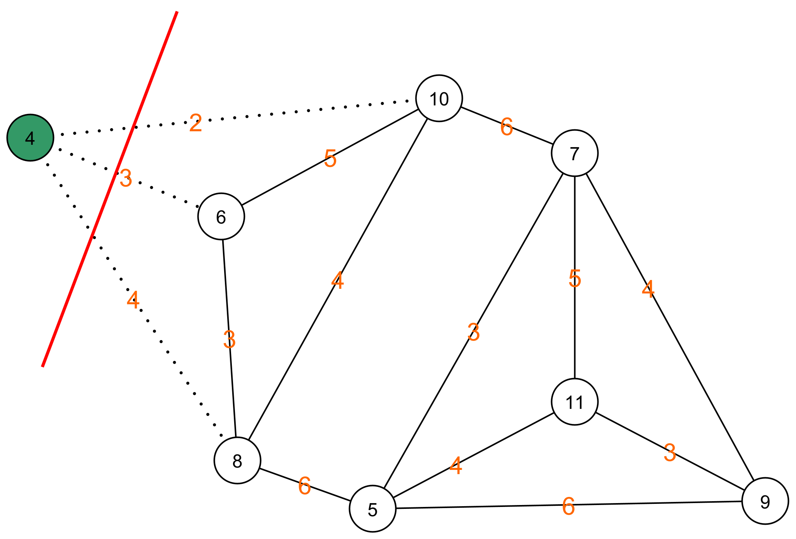

# Monte Carlo

## Algoritme van Karger: opmerking

Zoals eerder werd aangegeven, zoekt dit algoritme enkel naar de minimale knip. Er wordt geen rekening gehouden met de gelijke verdeling tussen de knopen. Het algoritme stelt hier dus voor om één knoop weg te knippen.



We kunnen dit oplossen door een extra voorwaarde toe te voegen aan de selectie van de minimale knip. 


```python

# Herhaal gokDeKnipKost n keer en onthoud de beste oplossing
def herhaalGokDeKnipKost(bogen_matrix, n=8):
    huidige_minimale_knip_kost = 100000 # Kies een arbitrair grote minimale kost om mee te starten.
    labels_van_minimale_knip = []
    for i in range(n):
        minknipkost, labels = gokDeKnipKost(bogen_matrix.copy())
        # Onthouw enkel de oplossing als deze beter is dan het huidige minimum en als het verschil tussen het aantal knopen in elk van de delen maximaal 1 is.
        if minknipkost < huidige_minimale_knip_kost and abs(len(labels[0]) - len(labels[1])) <= 1:
            huidige_minimale_knip_kost = minknipkost
            labels_van_minimale_knip = labels
    return huidige_minimale_knip_kost, labels_van_minimale_knip

```

In dat geval komen we wel aan een correcte oplossing:

De minimale knip is:  12
De labels van de knopen zijn:  [[0, 4, 6, 2], [1, 3, 7, 5]]

**Merk op dat we in dit geval niet meer kunnen bewijzen dat we binnen aanvaardbare tijd tot een aanvaardbare oplossing komen!**