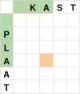

# Een algoritme (1)

Om de Levenshtein afstand altijd op een correcte manier te kunnen berekenen, moeten we een **stappenplan** opstellen. Zo'n **stappenplan** noemen we een **algoritme**. Bij het opstellen van zo'n stappenplan moeten we er rekening mee houden dat we het stappenplan willen kunnen laten uitvoeren door een computer. Omdat we hier een manier bedenken op het probleem op te lossen met de computer doen we aan **computationeel denken**.

## Onze gegevens voorstellen

Om ons algoritme uit te kunnen voeren met de computer, moeten we onze gegevens op een manier voorstellen die de computer begrijpt. In dit geval doen we dat aan de hand van een tabel. Hieronder zie je een voorbeeld van hoe die tabel eruitziet als we de afstand willen zoeken tussen het woord PLAAT en het woord KAST.

<table>
    <tr>
        <td></td>
        <td>Zoals je kan zien op de afbeelding, zetten we het woord waarvan we vertrekken in de eerste kolom. Het woord waar we naartoe willen zetten we in de eerste rij. Merk op dat we telkens ook een <strong>leeg vakje</strong> voor het woord plaatsen (coördinaten (1, 0) en (0, 1)). Dit leeg vakje stelt het lege woord voor. Het vakje linksboven (coördinaat (0, 0)) heeft geen betekenis. In de overige vakjes vullen we in wat de afstand is tussen de prefix van het woord dat links staat naar de prefix van het woord dat rechts staat. Hieronder zie je daar twee voorbeelden van.</td>
    </tr>
    <tr>
        <td></td>
        <td>De waarde die we in het oranje vakje (3, 4) zullen schrijven is de afstand tussen PLA en KA.</td>
    </tr>
    <tr>
        <td></td>
        <td>De waarde die we in het oranje vakje (4, 2) zullen schrijven is de afstand tussen P en KAS.</td>
    </tr>
</table>

We hebben nu een **gegevensvoorstelling** (ofwel een **datastructuur**) waarin we de gegevens van ons probleem zullen opslaan. Nu hebben we nog een **stappenplan** (ofwel een **algoritme**) nodig om deze **datastructuur** in te vullen.