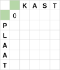
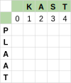
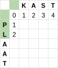
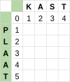

# Een algoritme (2)

## De regels

Zoals we in het begin van dit leerpad beschreven, zijn er drie mogelijk operaties om een startwoord aan te passen naar een doelwoord.

1. Een letter van het doelwoord aan het startwoord toevoegen.
2. Een letter uit het startwoord verwijderen.
3. Een letter in het startwoord vervangen door een letter in het doelwoord.

Aan elk van deze operaties koppelen we nu een kost om deze uit te voeren.

1. Letter toevoegen aan het startwoord = kost 1.
2. Letter verwijderen uit het startwoord = kost 1.
3. Letter in het startwoord vervangen door een letter in het doelwoord = kost 1 als de letters verschillend zijn anders is de kost 0.

## Tabel invullen (van en naar lege woord)

Om de tabel in te vullen, starten we met de eenvoudige gevallen. Deze zijn de vakjes van de tweede rij en de tweede kolom van het raster. Hier ga je telkens van een leeg woord naar een woord met een aantal letters of omgekeerd.
.

    <table>
        <tr>
            <td style="width:375px;min-width:250px"></td>
            <td style="min-width:250px">Om van het lege woord naar het lege woord te gaan moeten we niets doen. De kost is hier dus 0.</td>
        </tr>
        <tr>
            <td></td>
            <td>Om van het lege woord naar KAST te gaan moeten we telkens een letter toevoegen. De kost om een letter toe te voegen is 1. De totale kost hiervoor is dus 4.</td>
        </tr>
        <tr>
            <td></td>
            <td>Om van het woord PL naar het lege woord te gaan moeten we PL weglaten. De kost is hier dus 2.</td>
        </tr>
        <tr>
            <td></td>
            <td>Met die redenering kunnen we dus de tweede rij en de tweede kolom van de tabel invullen.</td>
        </tr>
    </table>

