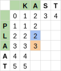
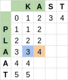
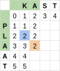
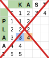
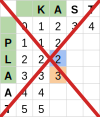
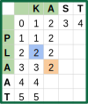

# Een algoritme (3)

Hieronder zie je nog een voorbeeld van hoe we een volgende vakje kunnen invullen.

<table>
    <tr>
        <td style="min-width:450px"></td>
        <td>Manier 1: De kost om van PL naar KA te gaan kennen we (= 2). Daar tellen we de kost bij op om A te verwijderen uit PLA (= 1). Voor dit geval dus 3 in totaal.</td>
    </tr>
    <tr>
        <td></td>
        <td>Manier 2: De kost om van PLA naar K te gaan kennen we (= 3). Daar tellen we de kost bij om A toe te voegen (= 1). Voor dit geval dus 4 in totaal.</td>
    </tr>
    <tr>
        <td></td>
        <td>Manier 3: De kost om van PL naar K te gaan kennen we (= 2). Daar tellen we de kost bij om A in A te veranderen (= 0). Voor dit geval dus 2 in totaal.</td>
    </tr>
</table>

We willen de minimale kost bepalen dus nemen we nu het minimum van deze drie gevallen en vullen die waarde permanent in in onze tabel.

<table>
    <tr>
        <td></td>
        <td></td>
        <td></td>
    </tr>
</table>

