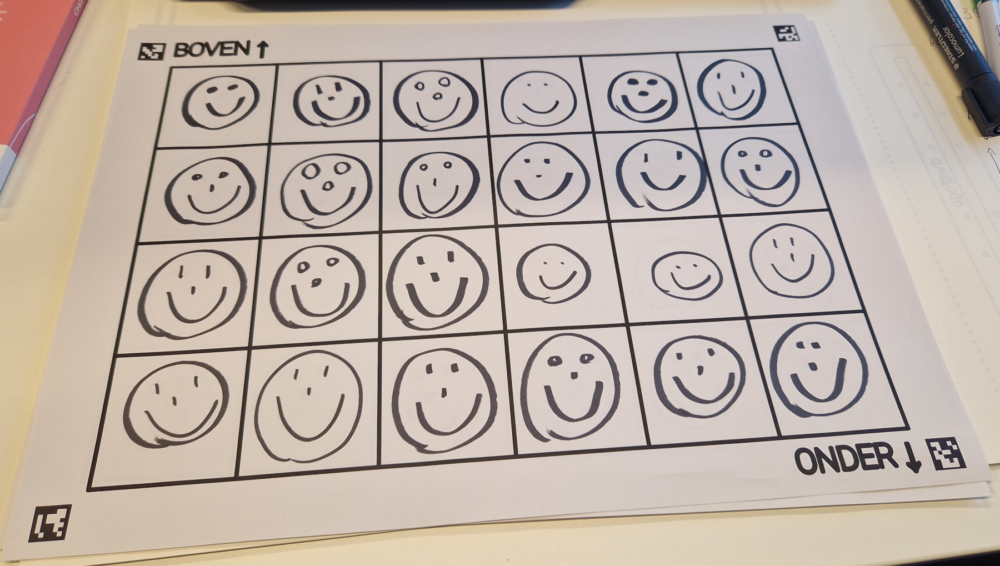
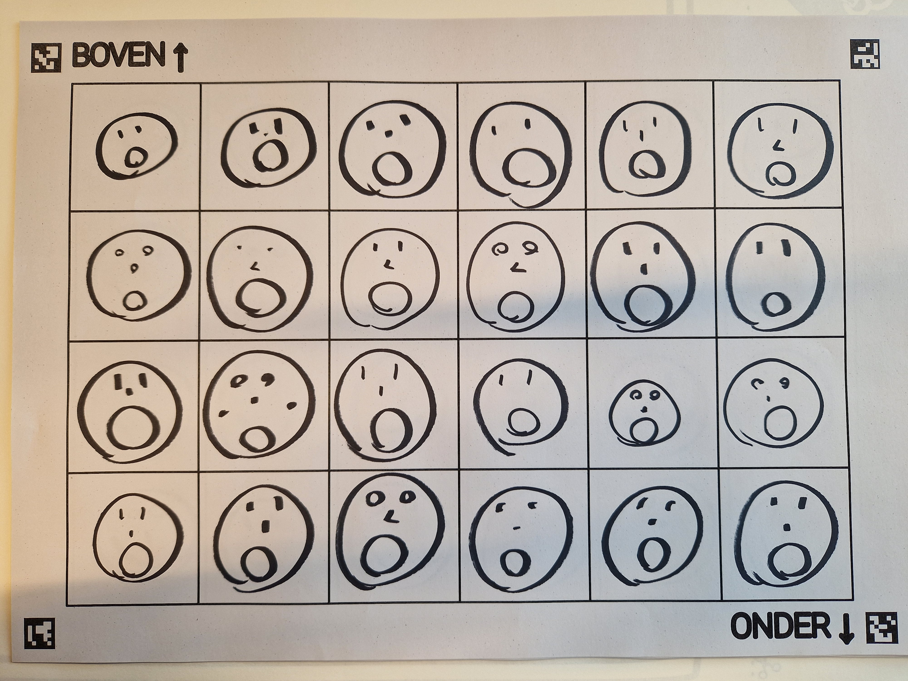

# Data verzamelen

Voor je een AI-systeem kan trainen, moet je een kwalitatieve dataset hebben. In deze activiteit zijn de deelnemers zelf verantwoordelijk om deze dataset op te stellen. Dit doen ze aan de hand van het volgende raster.

Je kan de pdf van het raster [hier](images/raster.pdf) downloaden. Druk dit raster minstens 10 keer af op A3 formaat. Op die manier kunnen de deelnemers voldoende data verzamelen om hun AI-systeem mee te trainen.

We starten met het bouwen van een eenvoudig AI-systeem dat de emoties *blij* en *verbaasd* van elkaar kan onderscheiden. Voor elk van deze emoties hebben we ongeveer 100 voorbeelden nodig. Om deze voorbeelden te verzamelen kunnen de leerlingen in het raster smileys tekenen met de overeenkomstige emotie. Hieronder zie je twee voorbeelden van ingevulde rasters.

**Opgelet**: Zorg ervoor dat een raster enkel tekeningen van één type emotie bevat. Een raster mag dus niet zowel blije als verbaasde smileys bevatten.