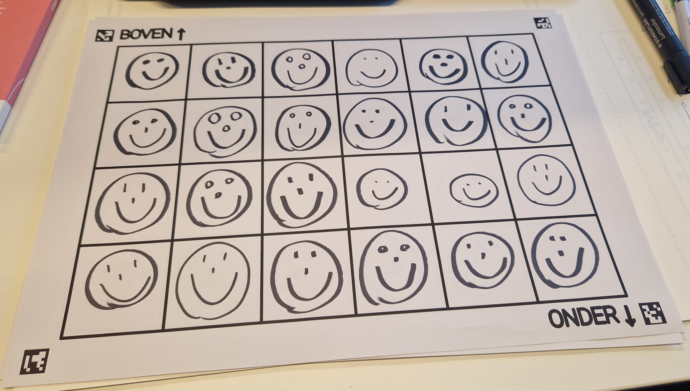

# Emoties tekenen

Je krijgt van je begeleider een A3-blad met het volgende raster.

Kies een emotie, *blij* of *verbaasd*, en teken het raster vol met smileys met die gekozen emotie. Koos je bijvoorbeeld voor *blij*, dan zou je ingevulde raster er als volgt kunnen uitzien:

<h2 class="title">Opgelet</h2>

Meng geen emoties in één raster. Op een blad mogen dus enkel smileys staan met één specifieke emotie, bv. blij!

