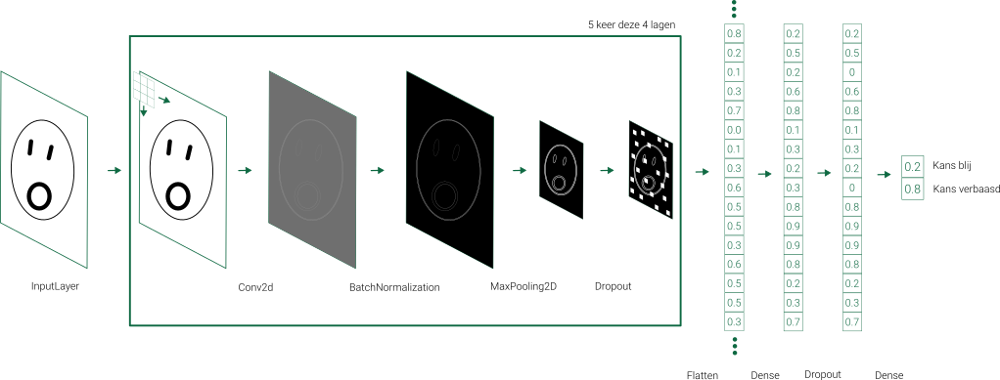

# Het neuraal netwerk dat kan leren om emoties te herkennen

In deel 1 van de activiteit over het herkennen van emoties trainde je het volgende neurale netwerk.



Je zag dat dat netwerk bestond uit verschillende lagen. 
- Een invoerlaag (InputLayer)
- Convolutionele lagen (Conv2d)
- Normalisatie lagen (BatchNormalization)
- Pooling lagen (MaxPooling2D)
- Dropout lagen (Dropout)
- Volledig geconnecteerde lagen (Dense)

We maakten gebruik van de volgende Python code om de lagen toe te voegen aan ons model.

```Python

model = Sequential()
    
    model.add(InputLayer(input_shape=(hoogte_afbeelding, breedte_afbeelding, 1)))
    
    model.add(Conv2D(1, (3, 3), activation="relu"))
    model.add(BatchNormalization())
    model.add(MaxPooling2D((2, 2)))
    model.add(Dropout(0.1))
    
    model.add(Conv2D(2, (3, 3), activation="relu"))
    model.add(BatchNormalization())
    model.add(MaxPooling2D((2, 2)))
    model.add(Dropout(0.1))
    
    model.add(Conv2D(4, (3, 3), activation="relu"))
    model.add(BatchNormalization())
    model.add(MaxPooling2D((2, 2)))
    model.add(Dropout(0.1))
    
    model.add(Conv2D(8, (3, 3), activation="relu"))
    model.add(BatchNormalization())
    model.add(MaxPooling2D((2, 2)))
    model.add(Dropout(0.1))
    
    model.add(Conv2D(16, (3, 3), activation="relu"))
    model.add(BatchNormalization())
    model.add(MaxPooling2D((2, 2)))
    model.add(Dropout(0.1))
    
    model.add(Flatten())
    model.add(Dense(16, activation="relu"))   
    model.add(Dropout(0.1)) 
    model.add(Dense(2, activation="softmax"))
    
    model.compile(optimizer="adam", loss="categorical_crossentropy", metrics=["accuracy"])

```

Dit model trainde je om de emoties van smileys te herkennen. In dit leerpad zal je zien waarvoor de verschillende lagen dienen. Daarna probeer je het model "kapot" te maken. Dat wil zeggen dat je lagen gaat verwijderen tot he niet meer goed lukt om het model te trainen om emoties te herkennen.
