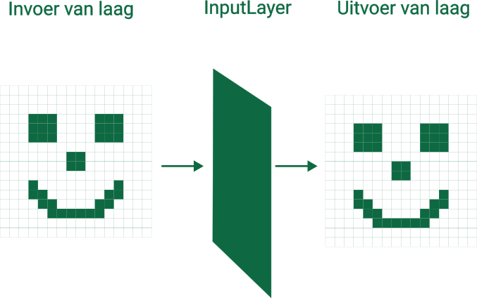

# De invoerlaag (InputLayer)

Deze laag is de eenvoudigste laag in het netwerk. Deze laag zal de gegevens die het ontvangt doorgeven aan de rest van het netwerk. Het zal dus de invoerafbeelding één op één doorgeven aan de volgende laag in het netwerk. Hieronder zie je visueel wat de invoerlaag doet

<h2 class="title">Wat is een laag?</h2>

Een laag kan je zien als een <strong>bewerking</strong> die een bepaalde <strong>invoer omvormt naar een bepaalde uitvoer</strong>. Hoe de invoer wordt omgevormd, ligt niet vast. Je kan gelijk welke operatie toepassen op de invoer. De enige voorwaarde is dat deze operatie <strong>afleidbaar</strong> is. De operatie moet afleidbaar zijn omdat we het netwerk anders niet kunnen trainen met <strong>gradient descent</strong>.

Bij de invoerlaag is de operatie dus een kopie nemen van de invoer.

