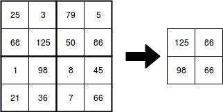

# Max pooling

De max pooling operatie zal pixels in een afbeelding samenvoegen tot 1 getal, het maximum van alle pixels in de *pool*. Hieronder zie je een voorbeeld van zo'n max pooling operatie met een grootte van 2x2 pixels.

Max pooling pas je om verschillende redenen toe. Hieronder worden de belangrijkste opgelijst.

- **Reduceren van de grootte van de afbeelding**: Max pooling zal de grootte van de afbeelding reduceren en tegelijk de belangrijkste informatie behouden. Hierdoor word het model eenvoudiger waardoor je het sneller kan trainen en evalueren.
- **Robuuster tegen kleine verschuivingen**: Door max pooling toe te passen maak je je model robuuster tegen kleine verschuivingen in de invoerafbeelding. 
- **Onderdrukt ruis**: Omdat max pooling altijd de maximale waarde neemt in een omgeving zullen kleine verschillen (ruis) in die regio genegeerd worden. Zo krijgen we een netwerk dat beter om kan gaan met ruis in afbeeldingen.
- **Beperkt overfitting**: Door het model eenvoudiger te maken reduceer je de kans dat het model de trainingsverzameling uit het hoofd leert. 

